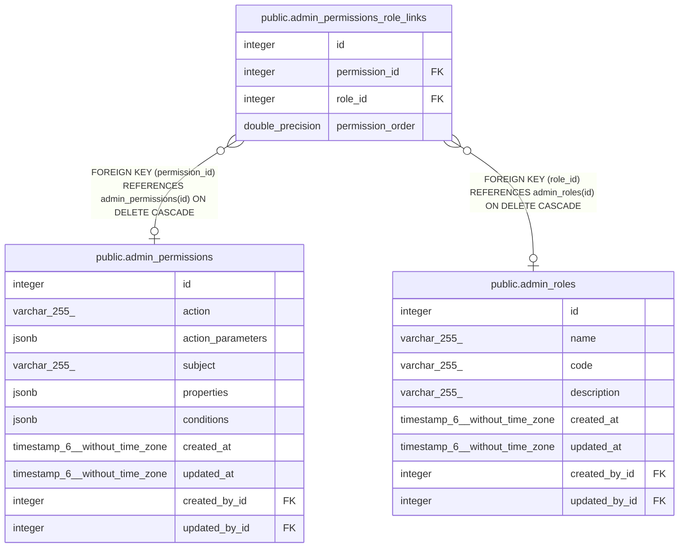

# public.admin_permissions_role_links

## Description

## Columns

| Name             | Type             | Default                                                  | Nullable | Children | Parents                                                 | Comment |
| ---------------- | ---------------- | -------------------------------------------------------- | -------- | -------- | ------------------------------------------------------- | ------- |
| id               | integer          | nextval('admin_permissions_role_links_id_seq'::regclass) | false    |          |                                                         |         |
| permission_id    | integer          |                                                          | true     |          | [public.admin_permissions](public.admin_permissions.md) |         |
| role_id          | integer          |                                                          | true     |          | [public.admin_roles](public.admin_roles.md)             |         |
| permission_order | double precision |                                                          | true     |          |                                                         |         |

## Constraints

| Name                                | Type        | Definition                                                                     |
| ----------------------------------- | ----------- | ------------------------------------------------------------------------------ |
| admin_permissions_role_links_fk     | FOREIGN KEY | FOREIGN KEY (permission_id) REFERENCES admin_permissions(id) ON DELETE CASCADE |
| admin_permissions_role_links_inv_fk | FOREIGN KEY | FOREIGN KEY (role_id) REFERENCES admin_roles(id) ON DELETE CASCADE             |
| admin_permissions_role_links_pkey   | PRIMARY KEY | PRIMARY KEY (id)                                                               |
| admin_permissions_role_links_unique | UNIQUE      | UNIQUE (permission_id, role_id)                                                |

## Indexes

| Name                                      | Definition                                                                                                                          |
| ----------------------------------------- | ----------------------------------------------------------------------------------------------------------------------------------- |
| admin_permissions_role_links_pkey         | CREATE UNIQUE INDEX admin_permissions_role_links_pkey ON public.admin_permissions_role_links USING btree (id)                       |
| admin_permissions_role_links_fk           | CREATE INDEX admin_permissions_role_links_fk ON public.admin_permissions_role_links USING btree (permission_id)                     |
| admin_permissions_role_links_inv_fk       | CREATE INDEX admin_permissions_role_links_inv_fk ON public.admin_permissions_role_links USING btree (role_id)                       |
| admin_permissions_role_links_unique       | CREATE UNIQUE INDEX admin_permissions_role_links_unique ON public.admin_permissions_role_links USING btree (permission_id, role_id) |
| admin_permissions_role_links_order_inv_fk | CREATE INDEX admin_permissions_role_links_order_inv_fk ON public.admin_permissions_role_links USING btree (permission_order)        |

## Relations

---

> Generated by [tbls](https://github.com/k1LoW/tbls)
