# public.admin_users

## Description

## Columns

| Name | Type | Default | Nullable | Children | Parents | Comment |
| ---- | ---- | ------- | -------- | -------- | ------- | ------- |
| id | integer | nextval('admin_users_id_seq'::regclass) | false | [public.admin_permissions](public.admin_permissions.md) [public.admin_users](public.admin_users.md) [public.admin_roles](public.admin_roles.md) [public.strapi_api_tokens](public.strapi_api_tokens.md) [public.strapi_api_token_permissions](public.strapi_api_token_permissions.md) [public.strapi_transfer_tokens](public.strapi_transfer_tokens.md) [public.strapi_transfer_token_permissions](public.strapi_transfer_token_permissions.md) [public.files](public.files.md) [public.upload_folders](public.upload_folders.md) [public.i18n_locale](public.i18n_locale.md) [public.up_permissions](public.up_permissions.md) [public.up_roles](public.up_roles.md) [public.up_users](public.up_users.md) [public.animals](public.animals.md) [public.animal_kinds](public.animal_kinds.md) [public.animal_logs](public.animal_logs.md) [public.employees](public.employees.md) [public.favorites](public.favorites.md) [public.institutions](public.institutions.md) [public.messages](public.messages.md) [public.notifications](public.notifications.md) [public.tasks](public.tasks.md) [public.timelines](public.timelines.md) [public.admin_users_roles_links](public.admin_users_roles_links.md) |  |  |
| firstname | varchar(255) |  | true |  |  |  |
| lastname | varchar(255) |  | true |  |  |  |
| username | varchar(255) |  | true |  |  |  |
| email | varchar(255) |  | true |  |  |  |
| password | varchar(255) |  | true |  |  |  |
| reset_password_token | varchar(255) |  | true |  |  |  |
| registration_token | varchar(255) |  | true |  |  |  |
| is_active | boolean |  | true |  |  |  |
| blocked | boolean |  | true |  |  |  |
| prefered_language | varchar(255) |  | true |  |  |  |
| created_at | timestamp(6) without time zone |  | true |  |  |  |
| updated_at | timestamp(6) without time zone |  | true |  |  |  |
| created_by_id | integer |  | true |  | [public.admin_users](public.admin_users.md) |  |
| updated_by_id | integer |  | true |  | [public.admin_users](public.admin_users.md) |  |

## Constraints

| Name | Type | Definition |
| ---- | ---- | ---------- |
| admin_users_created_by_id_fk | FOREIGN KEY | FOREIGN KEY (created_by_id) REFERENCES admin_users(id) ON DELETE SET NULL |
| admin_users_pkey | PRIMARY KEY | PRIMARY KEY (id) |
| admin_users_updated_by_id_fk | FOREIGN KEY | FOREIGN KEY (updated_by_id) REFERENCES admin_users(id) ON DELETE SET NULL |

## Indexes

| Name | Definition |
| ---- | ---------- |
| admin_users_pkey | CREATE UNIQUE INDEX admin_users_pkey ON public.admin_users USING btree (id) |
| admin_users_created_by_id_fk | CREATE INDEX admin_users_created_by_id_fk ON public.admin_users USING btree (created_by_id) |
| admin_users_updated_by_id_fk | CREATE INDEX admin_users_updated_by_id_fk ON public.admin_users USING btree (updated_by_id) |

## Relations

```mermaid
erDiagram

"public.admin_permissions" }o--o| "public.admin_users" : "FOREIGN KEY (created_by_id) REFERENCES admin_users(id) ON DELETE SET NULL"
"public.admin_permissions" }o--o| "public.admin_users" : "FOREIGN KEY (updated_by_id) REFERENCES admin_users(id) ON DELETE SET NULL"
"public.admin_users" }o--o| "public.admin_users" : "FOREIGN KEY (created_by_id) REFERENCES admin_users(id) ON DELETE SET NULL"
"public.admin_users" }o--o| "public.admin_users" : "FOREIGN KEY (updated_by_id) REFERENCES admin_users(id) ON DELETE SET NULL"
"public.admin_roles" }o--o| "public.admin_users" : "FOREIGN KEY (created_by_id) REFERENCES admin_users(id) ON DELETE SET NULL"
"public.admin_roles" }o--o| "public.admin_users" : "FOREIGN KEY (updated_by_id) REFERENCES admin_users(id) ON DELETE SET NULL"
"public.strapi_api_tokens" }o--o| "public.admin_users" : "FOREIGN KEY (created_by_id) REFERENCES admin_users(id) ON DELETE SET NULL"
"public.strapi_api_tokens" }o--o| "public.admin_users" : "FOREIGN KEY (updated_by_id) REFERENCES admin_users(id) ON DELETE SET NULL"
"public.strapi_api_token_permissions" }o--o| "public.admin_users" : "FOREIGN KEY (created_by_id) REFERENCES admin_users(id) ON DELETE SET NULL"
"public.strapi_api_token_permissions" }o--o| "public.admin_users" : "FOREIGN KEY (updated_by_id) REFERENCES admin_users(id) ON DELETE SET NULL"
"public.strapi_transfer_tokens" }o--o| "public.admin_users" : "FOREIGN KEY (created_by_id) REFERENCES admin_users(id) ON DELETE SET NULL"
"public.strapi_transfer_tokens" }o--o| "public.admin_users" : "FOREIGN KEY (updated_by_id) REFERENCES admin_users(id) ON DELETE SET NULL"
"public.strapi_transfer_token_permissions" }o--o| "public.admin_users" : "FOREIGN KEY (created_by_id) REFERENCES admin_users(id) ON DELETE SET NULL"
"public.strapi_transfer_token_permissions" }o--o| "public.admin_users" : "FOREIGN KEY (updated_by_id) REFERENCES admin_users(id) ON DELETE SET NULL"
"public.files" }o--o| "public.admin_users" : "FOREIGN KEY (created_by_id) REFERENCES admin_users(id) ON DELETE SET NULL"
"public.files" }o--o| "public.admin_users" : "FOREIGN KEY (updated_by_id) REFERENCES admin_users(id) ON DELETE SET NULL"
"public.upload_folders" }o--o| "public.admin_users" : "FOREIGN KEY (created_by_id) REFERENCES admin_users(id) ON DELETE SET NULL"
"public.upload_folders" }o--o| "public.admin_users" : "FOREIGN KEY (updated_by_id) REFERENCES admin_users(id) ON DELETE SET NULL"
"public.i18n_locale" }o--o| "public.admin_users" : "FOREIGN KEY (created_by_id) REFERENCES admin_users(id) ON DELETE SET NULL"
"public.i18n_locale" }o--o| "public.admin_users" : "FOREIGN KEY (updated_by_id) REFERENCES admin_users(id) ON DELETE SET NULL"
"public.up_permissions" }o--o| "public.admin_users" : "FOREIGN KEY (created_by_id) REFERENCES admin_users(id) ON DELETE SET NULL"
"public.up_permissions" }o--o| "public.admin_users" : "FOREIGN KEY (updated_by_id) REFERENCES admin_users(id) ON DELETE SET NULL"
"public.up_roles" }o--o| "public.admin_users" : "FOREIGN KEY (created_by_id) REFERENCES admin_users(id) ON DELETE SET NULL"
"public.up_roles" }o--o| "public.admin_users" : "FOREIGN KEY (updated_by_id) REFERENCES admin_users(id) ON DELETE SET NULL"
"public.up_users" }o--o| "public.admin_users" : "FOREIGN KEY (created_by_id) REFERENCES admin_users(id) ON DELETE SET NULL"
"public.up_users" }o--o| "public.admin_users" : "FOREIGN KEY (updated_by_id) REFERENCES admin_users(id) ON DELETE SET NULL"
"public.animals" }o--o| "public.admin_users" : "FOREIGN KEY (created_by_id) REFERENCES admin_users(id) ON DELETE SET NULL"
"public.animals" }o--o| "public.admin_users" : "FOREIGN KEY (updated_by_id) REFERENCES admin_users(id) ON DELETE SET NULL"
"public.animal_kinds" }o--o| "public.admin_users" : "FOREIGN KEY (created_by_id) REFERENCES admin_users(id) ON DELETE SET NULL"
"public.animal_kinds" }o--o| "public.admin_users" : "FOREIGN KEY (updated_by_id) REFERENCES admin_users(id) ON DELETE SET NULL"
"public.animal_logs" }o--o| "public.admin_users" : "FOREIGN KEY (created_by_id) REFERENCES admin_users(id) ON DELETE SET NULL"
"public.animal_logs" }o--o| "public.admin_users" : "FOREIGN KEY (updated_by_id) REFERENCES admin_users(id) ON DELETE SET NULL"
"public.employees" }o--o| "public.admin_users" : "FOREIGN KEY (created_by_id) REFERENCES admin_users(id) ON DELETE SET NULL"
"public.employees" }o--o| "public.admin_users" : "FOREIGN KEY (updated_by_id) REFERENCES admin_users(id) ON DELETE SET NULL"
"public.favorites" }o--o| "public.admin_users" : "FOREIGN KEY (created_by_id) REFERENCES admin_users(id) ON DELETE SET NULL"
"public.favorites" }o--o| "public.admin_users" : "FOREIGN KEY (updated_by_id) REFERENCES admin_users(id) ON DELETE SET NULL"
"public.institutions" }o--o| "public.admin_users" : "FOREIGN KEY (created_by_id) REFERENCES admin_users(id) ON DELETE SET NULL"
"public.institutions" }o--o| "public.admin_users" : "FOREIGN KEY (updated_by_id) REFERENCES admin_users(id) ON DELETE SET NULL"
"public.messages" }o--o| "public.admin_users" : "FOREIGN KEY (created_by_id) REFERENCES admin_users(id) ON DELETE SET NULL"
"public.messages" }o--o| "public.admin_users" : "FOREIGN KEY (updated_by_id) REFERENCES admin_users(id) ON DELETE SET NULL"
"public.notifications" }o--o| "public.admin_users" : "FOREIGN KEY (created_by_id) REFERENCES admin_users(id) ON DELETE SET NULL"
"public.notifications" }o--o| "public.admin_users" : "FOREIGN KEY (updated_by_id) REFERENCES admin_users(id) ON DELETE SET NULL"
"public.tasks" }o--o| "public.admin_users" : "FOREIGN KEY (created_by_id) REFERENCES admin_users(id) ON DELETE SET NULL"
"public.tasks" }o--o| "public.admin_users" : "FOREIGN KEY (updated_by_id) REFERENCES admin_users(id) ON DELETE SET NULL"
"public.timelines" }o--o| "public.admin_users" : "FOREIGN KEY (created_by_id) REFERENCES admin_users(id) ON DELETE SET NULL"
"public.timelines" }o--o| "public.admin_users" : "FOREIGN KEY (updated_by_id) REFERENCES admin_users(id) ON DELETE SET NULL"
"public.admin_users_roles_links" }o--o| "public.admin_users" : "FOREIGN KEY (user_id) REFERENCES admin_users(id) ON DELETE CASCADE"

"public.admin_users" {
  integer id
  varchar_255_ firstname
  varchar_255_ lastname
  varchar_255_ username
  varchar_255_ email
  varchar_255_ password
  varchar_255_ reset_password_token
  varchar_255_ registration_token
  boolean is_active
  boolean blocked
  varchar_255_ prefered_language
  timestamp_6__without_time_zone created_at
  timestamp_6__without_time_zone updated_at
  integer created_by_id FK
  integer updated_by_id FK
}
"public.admin_permissions" {
  integer id
  varchar_255_ action
  jsonb action_parameters
  varchar_255_ subject
  jsonb properties
  jsonb conditions
  timestamp_6__without_time_zone created_at
  timestamp_6__without_time_zone updated_at
  integer created_by_id FK
  integer updated_by_id FK
}
"public.admin_roles" {
  integer id
  varchar_255_ name
  varchar_255_ code
  varchar_255_ description
  timestamp_6__without_time_zone created_at
  timestamp_6__without_time_zone updated_at
  integer created_by_id FK
  integer updated_by_id FK
}
"public.strapi_api_tokens" {
  integer id
  varchar_255_ name
  varchar_255_ description
  varchar_255_ type
  varchar_255_ access_key
  timestamp_6__without_time_zone last_used_at
  timestamp_6__without_time_zone expires_at
  bigint lifespan
  timestamp_6__without_time_zone created_at
  timestamp_6__without_time_zone updated_at
  integer created_by_id FK
  integer updated_by_id FK
}
"public.strapi_api_token_permissions" {
  integer id
  varchar_255_ action
  timestamp_6__without_time_zone created_at
  timestamp_6__without_time_zone updated_at
  integer created_by_id FK
  integer updated_by_id FK
}
"public.strapi_transfer_tokens" {
  integer id
  varchar_255_ name
  varchar_255_ description
  varchar_255_ access_key
  timestamp_6__without_time_zone last_used_at
  timestamp_6__without_time_zone expires_at
  bigint lifespan
  timestamp_6__without_time_zone created_at
  timestamp_6__without_time_zone updated_at
  integer created_by_id FK
  integer updated_by_id FK
}
"public.strapi_transfer_token_permissions" {
  integer id
  varchar_255_ action
  timestamp_6__without_time_zone created_at
  timestamp_6__without_time_zone updated_at
  integer created_by_id FK
  integer updated_by_id FK
}
"public.files" {
  integer id
  varchar_255_ name
  varchar_255_ alternative_text
  varchar_255_ caption
  integer width
  integer height
  jsonb formats
  varchar_255_ hash
  varchar_255_ ext
  varchar_255_ mime
  numeric_10_2_ size
  varchar_255_ url
  varchar_255_ preview_url
  varchar_255_ provider
  jsonb provider_metadata
  varchar_255_ folder_path
  timestamp_6__without_time_zone created_at
  timestamp_6__without_time_zone updated_at
  integer created_by_id FK
  integer updated_by_id FK
}
"public.upload_folders" {
  integer id
  varchar_255_ name
  integer path_id
  varchar_255_ path
  timestamp_6__without_time_zone created_at
  timestamp_6__without_time_zone updated_at
  integer created_by_id FK
  integer updated_by_id FK
}
"public.i18n_locale" {
  integer id
  varchar_255_ name
  varchar_255_ code
  timestamp_6__without_time_zone created_at
  timestamp_6__without_time_zone updated_at
  integer created_by_id FK
  integer updated_by_id FK
}
"public.up_permissions" {
  integer id
  varchar_255_ action
  timestamp_6__without_time_zone created_at
  timestamp_6__without_time_zone updated_at
  integer created_by_id FK
  integer updated_by_id FK
}
"public.up_roles" {
  integer id
  varchar_255_ name
  varchar_255_ description
  varchar_255_ type
  timestamp_6__without_time_zone created_at
  timestamp_6__without_time_zone updated_at
  integer created_by_id FK
  integer updated_by_id FK
}
"public.up_users" {
  integer id
  varchar_255_ username
  varchar_255_ email
  varchar_255_ provider
  varchar_255_ password
  varchar_255_ reset_password_token
  varchar_255_ confirmation_token
  boolean confirmed
  boolean blocked
  boolean employee
  timestamp_6__without_time_zone created_at
  timestamp_6__without_time_zone updated_at
  integer created_by_id FK
  integer updated_by_id FK
}
"public.animals" {
  integer id
  varchar_255_ name
  integer age
  varchar_255_ gender
  text personality
  varchar_255_ interest
  text description
  timestamp_6__without_time_zone created_at
  timestamp_6__without_time_zone updated_at
  timestamp_6__without_time_zone published_at
  integer created_by_id FK
  integer updated_by_id FK
}
"public.animal_kinds" {
  integer id
  varchar_255_ name
  timestamp_6__without_time_zone created_at
  timestamp_6__without_time_zone updated_at
  timestamp_6__without_time_zone published_at
  integer created_by_id FK
  integer updated_by_id FK
}
"public.animal_logs" {
  integer id
  varchar_255_ content
  timestamp_6__without_time_zone created_at
  timestamp_6__without_time_zone updated_at
  timestamp_6__without_time_zone published_at
  integer created_by_id FK
  integer updated_by_id FK
}
"public.employees" {
  integer id
  timestamp_6__without_time_zone created_at
  timestamp_6__without_time_zone updated_at
  timestamp_6__without_time_zone published_at
  integer created_by_id FK
  integer updated_by_id FK
}
"public.favorites" {
  integer id
  timestamp_6__without_time_zone created_at
  timestamp_6__without_time_zone updated_at
  timestamp_6__without_time_zone published_at
  integer created_by_id FK
  integer updated_by_id FK
}
"public.institutions" {
  integer id
  varchar_255_ name
  varchar_255_ address
  varchar_255_ phone
  varchar_255_ website_url
  varchar_255_ needs_url
  text description
  timestamp_6__without_time_zone created_at
  timestamp_6__without_time_zone updated_at
  timestamp_6__without_time_zone published_at
  integer created_by_id FK
  integer updated_by_id FK
}
"public.messages" {
  integer id
  text content
  timestamp_6__without_time_zone created_at
  timestamp_6__without_time_zone updated_at
  timestamp_6__without_time_zone published_at
  integer created_by_id FK
  integer updated_by_id FK
}
"public.notifications" {
  integer id
  varchar_255_ content
  timestamp_6__without_time_zone created_at
  timestamp_6__without_time_zone updated_at
  timestamp_6__without_time_zone published_at
  integer created_by_id FK
  integer updated_by_id FK
}
"public.tasks" {
  integer id
  varchar_255_ title
  text content
  timestamp_6__without_time_zone created_at
  timestamp_6__without_time_zone updated_at
  timestamp_6__without_time_zone published_at
  integer created_by_id FK
  integer updated_by_id FK
}
"public.timelines" {
  integer id
  text content
  integer footprints
  timestamp_6__without_time_zone created_at
  timestamp_6__without_time_zone updated_at
  timestamp_6__without_time_zone published_at
  integer created_by_id FK
  integer updated_by_id FK
}
"public.admin_users_roles_links" {
  integer id
  integer user_id FK
  integer role_id FK
  double_precision role_order
  double_precision user_order
}
```

---

> Generated by [tbls](https://github.com/k1LoW/tbls)
