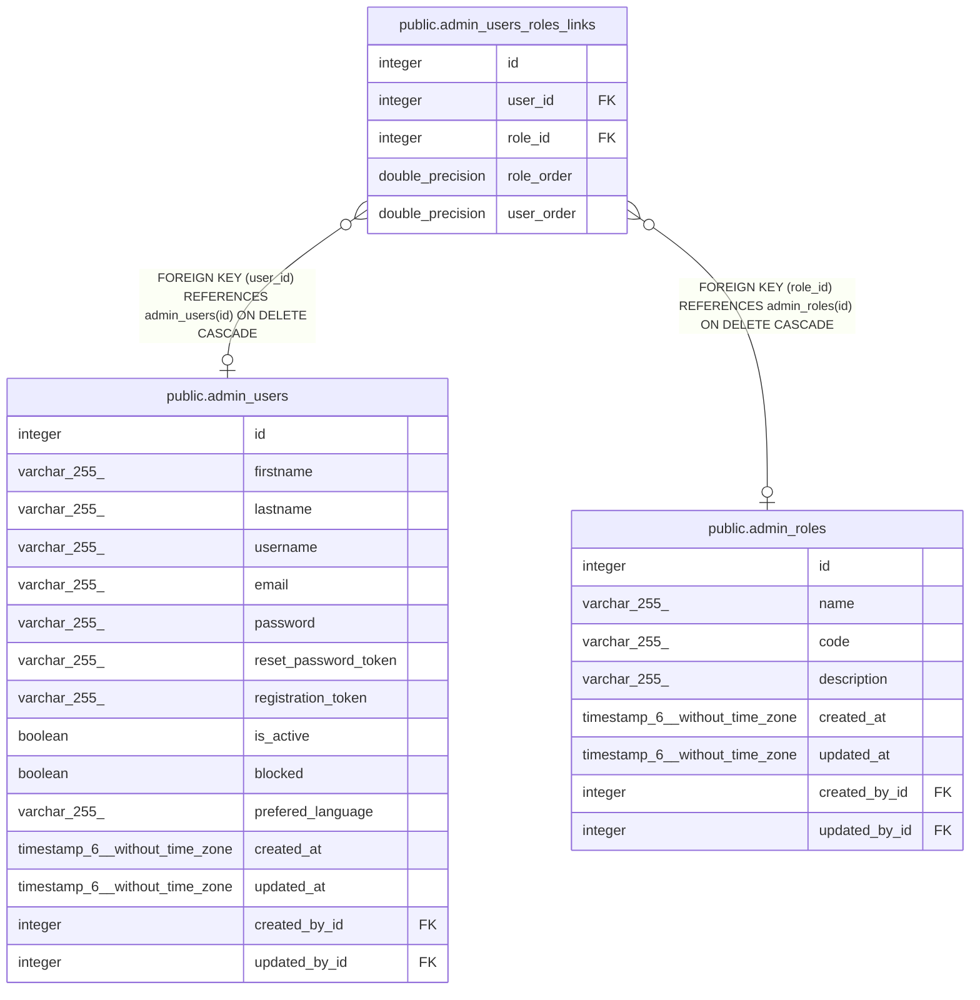

# public.admin_users_roles_links

## Description

## Columns

| Name       | Type             | Default                                             | Nullable | Children | Parents                                     | Comment |
| ---------- | ---------------- | --------------------------------------------------- | -------- | -------- | ------------------------------------------- | ------- |
| id         | integer          | nextval('admin_users_roles_links_id_seq'::regclass) | false    |          |                                             |         |
| user_id    | integer          |                                                     | true     |          | [public.admin_users](public.admin_users.md) |         |
| role_id    | integer          |                                                     | true     |          | [public.admin_roles](public.admin_roles.md) |         |
| role_order | double precision |                                                     | true     |          |                                             |         |
| user_order | double precision |                                                     | true     |          |                                             |         |

## Constraints

| Name                           | Type        | Definition                                                         |
| ------------------------------ | ----------- | ------------------------------------------------------------------ |
| admin_users_roles_links_fk     | FOREIGN KEY | FOREIGN KEY (user_id) REFERENCES admin_users(id) ON DELETE CASCADE |
| admin_users_roles_links_inv_fk | FOREIGN KEY | FOREIGN KEY (role_id) REFERENCES admin_roles(id) ON DELETE CASCADE |
| admin_users_roles_links_pkey   | PRIMARY KEY | PRIMARY KEY (id)                                                   |
| admin_users_roles_links_unique | UNIQUE      | UNIQUE (user_id, role_id)                                          |

## Indexes

| Name                                 | Definition                                                                                                          |
| ------------------------------------ | ------------------------------------------------------------------------------------------------------------------- |
| admin_users_roles_links_pkey         | CREATE UNIQUE INDEX admin_users_roles_links_pkey ON public.admin_users_roles_links USING btree (id)                 |
| admin_users_roles_links_fk           | CREATE INDEX admin_users_roles_links_fk ON public.admin_users_roles_links USING btree (user_id)                     |
| admin_users_roles_links_inv_fk       | CREATE INDEX admin_users_roles_links_inv_fk ON public.admin_users_roles_links USING btree (role_id)                 |
| admin_users_roles_links_unique       | CREATE UNIQUE INDEX admin_users_roles_links_unique ON public.admin_users_roles_links USING btree (user_id, role_id) |
| admin_users_roles_links_order_fk     | CREATE INDEX admin_users_roles_links_order_fk ON public.admin_users_roles_links USING btree (role_order)            |
| admin_users_roles_links_order_inv_fk | CREATE INDEX admin_users_roles_links_order_inv_fk ON public.admin_users_roles_links USING btree (user_order)        |

## Relations

---

> Generated by [tbls](https://github.com/k1LoW/tbls)
