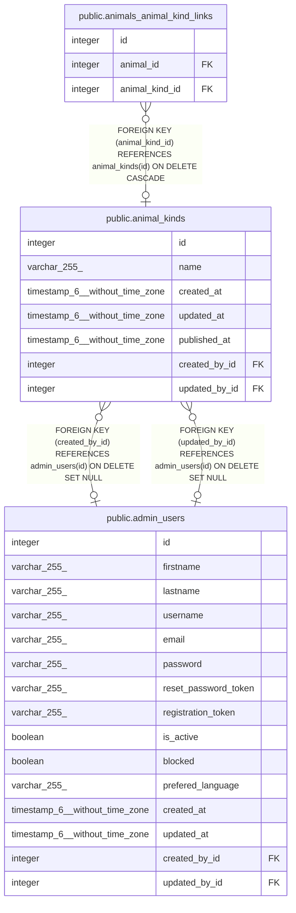

# public.animal_kinds

## Description

## Columns

| Name          | Type                           | Default                                  | Nullable | Children                                                                | Parents                                     | Comment |
| ------------- | ------------------------------ | ---------------------------------------- | -------- | ----------------------------------------------------------------------- | ------------------------------------------- | ------- |
| id            | integer                        | nextval('animal_kinds_id_seq'::regclass) | false    | [public.animals_animal_kind_links](public.animals_animal_kind_links.md) |                                             |         |
| name          | varchar(255)                   |                                          | true     |                                                                         |                                             |         |
| created_at    | timestamp(6) without time zone |                                          | true     |                                                                         |                                             |         |
| updated_at    | timestamp(6) without time zone |                                          | true     |                                                                         |                                             |         |
| published_at  | timestamp(6) without time zone |                                          | true     |                                                                         |                                             |         |
| created_by_id | integer                        |                                          | true     |                                                                         | [public.admin_users](public.admin_users.md) |         |
| updated_by_id | integer                        |                                          | true     |                                                                         | [public.admin_users](public.admin_users.md) |         |

## Constraints

| Name                          | Type        | Definition                                                                |
| ----------------------------- | ----------- | ------------------------------------------------------------------------- |
| animal_kinds_created_by_id_fk | FOREIGN KEY | FOREIGN KEY (created_by_id) REFERENCES admin_users(id) ON DELETE SET NULL |
| animal_kinds_updated_by_id_fk | FOREIGN KEY | FOREIGN KEY (updated_by_id) REFERENCES admin_users(id) ON DELETE SET NULL |
| animal_kinds_pkey             | PRIMARY KEY | PRIMARY KEY (id)                                                          |

## Indexes

| Name                          | Definition                                                                                    |
| ----------------------------- | --------------------------------------------------------------------------------------------- |
| animal_kinds_pkey             | CREATE UNIQUE INDEX animal_kinds_pkey ON public.animal_kinds USING btree (id)                 |
| animal_kinds_created_by_id_fk | CREATE INDEX animal_kinds_created_by_id_fk ON public.animal_kinds USING btree (created_by_id) |
| animal_kinds_updated_by_id_fk | CREATE INDEX animal_kinds_updated_by_id_fk ON public.animal_kinds USING btree (updated_by_id) |

## Relations

---

> Generated by [tbls](https://github.com/k1LoW/tbls)
