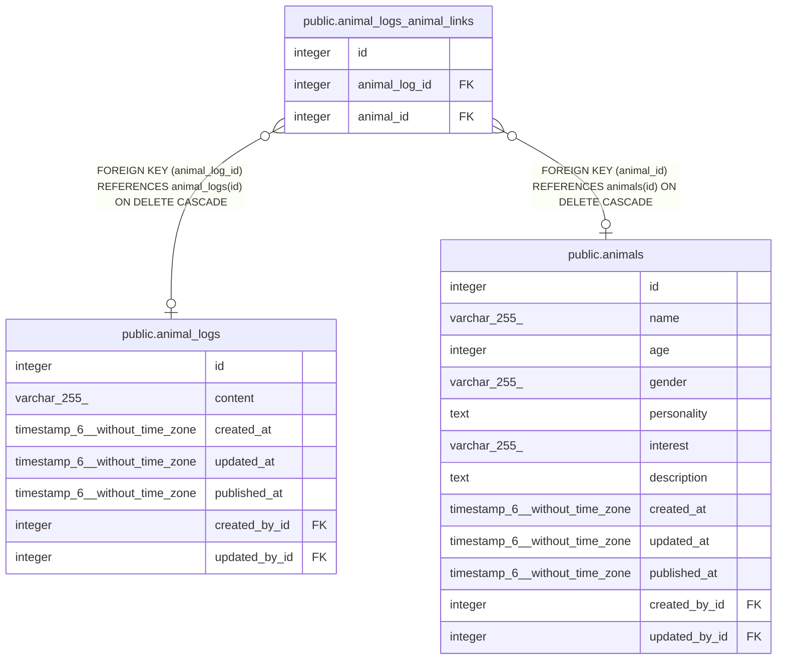

# public.animal_logs_animal_links

## Description

## Columns

| Name          | Type    | Default                                              | Nullable | Children | Parents                                     | Comment |
| ------------- | ------- | ---------------------------------------------------- | -------- | -------- | ------------------------------------------- | ------- |
| id            | integer | nextval('animal_logs_animal_links_id_seq'::regclass) | false    |          |                                             |         |
| animal_log_id | integer |                                                      | true     |          | [public.animal_logs](public.animal_logs.md) |         |
| animal_id     | integer |                                                      | true     |          | [public.animals](public.animals.md)         |         |

## Constraints

| Name                            | Type        | Definition                                                               |
| ------------------------------- | ----------- | ------------------------------------------------------------------------ |
| animal_logs_animal_links_inv_fk | FOREIGN KEY | FOREIGN KEY (animal_id) REFERENCES animals(id) ON DELETE CASCADE         |
| animal_logs_animal_links_fk     | FOREIGN KEY | FOREIGN KEY (animal_log_id) REFERENCES animal_logs(id) ON DELETE CASCADE |
| animal_logs_animal_links_pkey   | PRIMARY KEY | PRIMARY KEY (id)                                                         |
| animal_logs_animal_links_unique | UNIQUE      | UNIQUE (animal_log_id, animal_id)                                        |

## Indexes

| Name                            | Definition                                                                                                                    |
| ------------------------------- | ----------------------------------------------------------------------------------------------------------------------------- |
| animal_logs_animal_links_pkey   | CREATE UNIQUE INDEX animal_logs_animal_links_pkey ON public.animal_logs_animal_links USING btree (id)                         |
| animal_logs_animal_links_fk     | CREATE INDEX animal_logs_animal_links_fk ON public.animal_logs_animal_links USING btree (animal_log_id)                       |
| animal_logs_animal_links_inv_fk | CREATE INDEX animal_logs_animal_links_inv_fk ON public.animal_logs_animal_links USING btree (animal_id)                       |
| animal_logs_animal_links_unique | CREATE UNIQUE INDEX animal_logs_animal_links_unique ON public.animal_logs_animal_links USING btree (animal_log_id, animal_id) |

## Relations

---

> Generated by [tbls](https://github.com/k1LoW/tbls)
