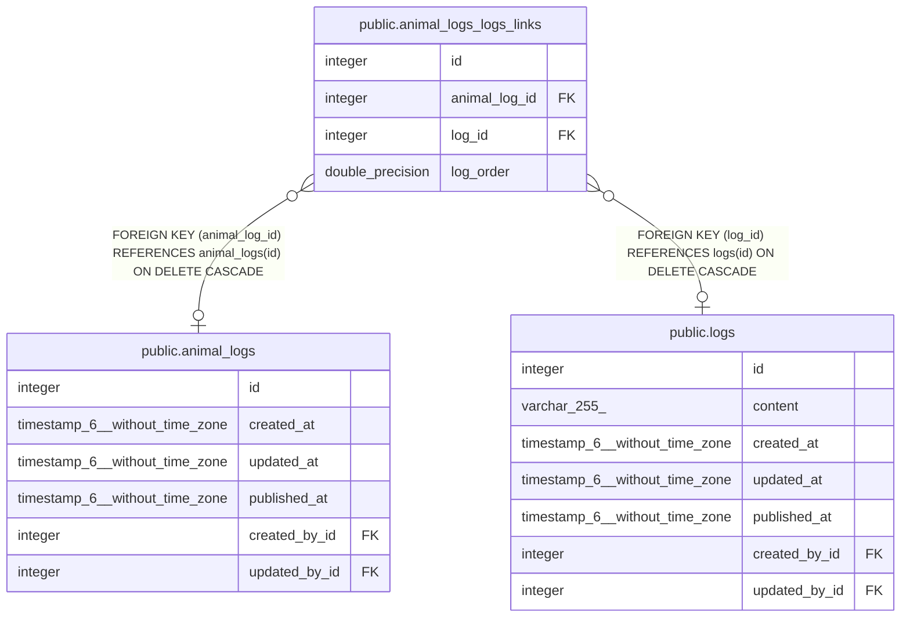

# public.animal_logs_logs_links

## Description

## Columns

| Name          | Type             | Default                                            | Nullable | Children | Parents                                     | Comment |
| ------------- | ---------------- | -------------------------------------------------- | -------- | -------- | ------------------------------------------- | ------- |
| id            | integer          | nextval('animal_logs_logs_links_id_seq'::regclass) | false    |          |                                             |         |
| animal_log_id | integer          |                                                    | true     |          | [public.animal_logs](public.animal_logs.md) |         |
| log_id        | integer          |                                                    | true     |          | [public.logs](public.logs.md)               |         |
| log_order     | double precision |                                                    | true     |          |                                             |         |

## Constraints

| Name                          | Type        | Definition                                                               |
| ----------------------------- | ----------- | ------------------------------------------------------------------------ |
| animal_logs_logs_links_fk     | FOREIGN KEY | FOREIGN KEY (animal_log_id) REFERENCES animal_logs(id) ON DELETE CASCADE |
| animal_logs_logs_links_inv_fk | FOREIGN KEY | FOREIGN KEY (log_id) REFERENCES logs(id) ON DELETE CASCADE               |
| animal_logs_logs_links_pkey   | PRIMARY KEY | PRIMARY KEY (id)                                                         |
| animal_logs_logs_links_unique | UNIQUE      | UNIQUE (animal_log_id, log_id)                                           |

## Indexes

| Name                            | Definition                                                                                                             |
| ------------------------------- | ---------------------------------------------------------------------------------------------------------------------- |
| animal_logs_logs_links_pkey     | CREATE UNIQUE INDEX animal_logs_logs_links_pkey ON public.animal_logs_logs_links USING btree (id)                      |
| animal_logs_logs_links_fk       | CREATE INDEX animal_logs_logs_links_fk ON public.animal_logs_logs_links USING btree (animal_log_id)                    |
| animal_logs_logs_links_inv_fk   | CREATE INDEX animal_logs_logs_links_inv_fk ON public.animal_logs_logs_links USING btree (log_id)                       |
| animal_logs_logs_links_unique   | CREATE UNIQUE INDEX animal_logs_logs_links_unique ON public.animal_logs_logs_links USING btree (animal_log_id, log_id) |
| animal_logs_logs_links_order_fk | CREATE INDEX animal_logs_logs_links_order_fk ON public.animal_logs_logs_links USING btree (log_order)                  |

## Relations

---

> Generated by [tbls](https://github.com/k1LoW/tbls)
