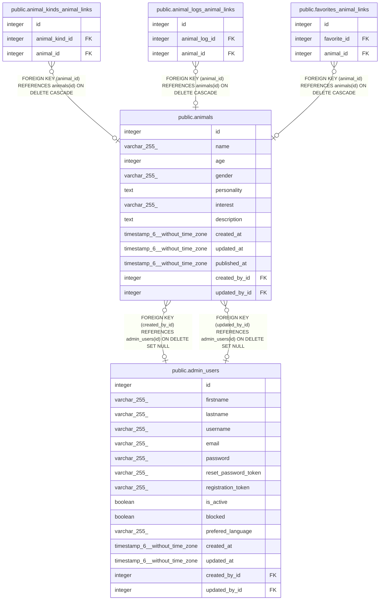

# public.animals

## Description

## Columns

| Name          | Type                           | Default                             | Nullable | Children                                                                                                                                                                                                        | Parents                                     | Comment |
| ------------- | ------------------------------ | ----------------------------------- | -------- | --------------------------------------------------------------------------------------------------------------------------------------------------------------------------------------------------------------- | ------------------------------------------- | ------- |
| id            | integer                        | nextval('animals_id_seq'::regclass) | false    | [public.animal_kinds_animal_links](public.animal_kinds_animal_links.md) [public.animal_logs_animal_links](public.animal_logs_animal_links.md) [public.favorites_animal_links](public.favorites_animal_links.md) |                                             |         |
| name          | varchar(255)                   |                                     | true     |                                                                                                                                                                                                                 |                                             |         |
| age           | integer                        |                                     | true     |                                                                                                                                                                                                                 |                                             |         |
| gender        | varchar(255)                   |                                     | true     |                                                                                                                                                                                                                 |                                             |         |
| personality   | text                           |                                     | true     |                                                                                                                                                                                                                 |                                             |         |
| interest      | varchar(255)                   |                                     | true     |                                                                                                                                                                                                                 |                                             |         |
| description   | text                           |                                     | true     |                                                                                                                                                                                                                 |                                             |         |
| created_at    | timestamp(6) without time zone |                                     | true     |                                                                                                                                                                                                                 |                                             |         |
| updated_at    | timestamp(6) without time zone |                                     | true     |                                                                                                                                                                                                                 |                                             |         |
| published_at  | timestamp(6) without time zone |                                     | true     |                                                                                                                                                                                                                 |                                             |         |
| created_by_id | integer                        |                                     | true     |                                                                                                                                                                                                                 | [public.admin_users](public.admin_users.md) |         |
| updated_by_id | integer                        |                                     | true     |                                                                                                                                                                                                                 | [public.admin_users](public.admin_users.md) |         |

## Constraints

| Name                     | Type        | Definition                                                                |
| ------------------------ | ----------- | ------------------------------------------------------------------------- |
| animals_created_by_id_fk | FOREIGN KEY | FOREIGN KEY (created_by_id) REFERENCES admin_users(id) ON DELETE SET NULL |
| animals_updated_by_id_fk | FOREIGN KEY | FOREIGN KEY (updated_by_id) REFERENCES admin_users(id) ON DELETE SET NULL |
| animals_pkey             | PRIMARY KEY | PRIMARY KEY (id)                                                          |

## Indexes

| Name                     | Definition                                                                          |
| ------------------------ | ----------------------------------------------------------------------------------- |
| animals_pkey             | CREATE UNIQUE INDEX animals_pkey ON public.animals USING btree (id)                 |
| animals_created_by_id_fk | CREATE INDEX animals_created_by_id_fk ON public.animals USING btree (created_by_id) |
| animals_updated_by_id_fk | CREATE INDEX animals_updated_by_id_fk ON public.animals USING btree (updated_by_id) |

## Relations

---

> Generated by [tbls](https://github.com/k1LoW/tbls)
