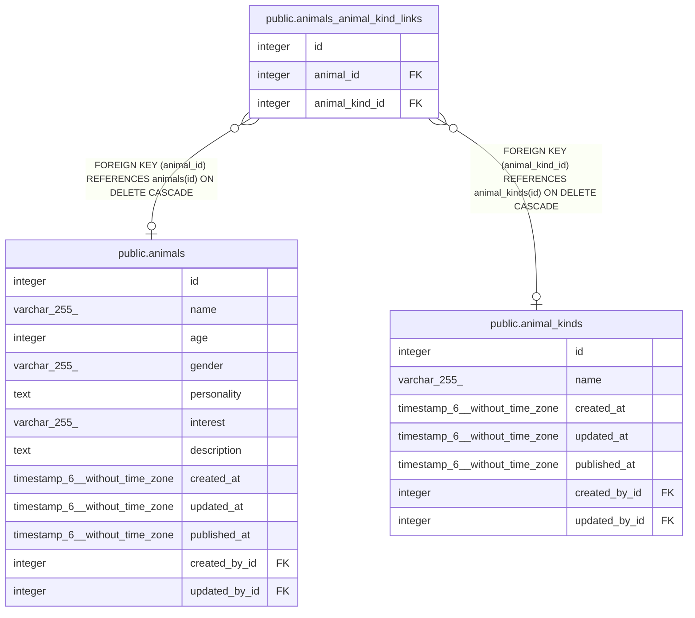

# public.animals_animal_kind_links

## Description

## Columns

| Name           | Type    | Default                                               | Nullable | Children | Parents                                       | Comment |
| -------------- | ------- | ----------------------------------------------------- | -------- | -------- | --------------------------------------------- | ------- |
| id             | integer | nextval('animals_animal_kind_links_id_seq'::regclass) | false    |          |                                               |         |
| animal_id      | integer |                                                       | true     |          | [public.animals](public.animals.md)           |         |
| animal_kind_id | integer |                                                       | true     |          | [public.animal_kinds](public.animal_kinds.md) |         |

## Constraints

| Name                             | Type        | Definition                                                                 |
| -------------------------------- | ----------- | -------------------------------------------------------------------------- |
| animals_animal_kind_links_fk     | FOREIGN KEY | FOREIGN KEY (animal_id) REFERENCES animals(id) ON DELETE CASCADE           |
| animals_animal_kind_links_inv_fk | FOREIGN KEY | FOREIGN KEY (animal_kind_id) REFERENCES animal_kinds(id) ON DELETE CASCADE |
| animals_animal_kind_links_pkey   | PRIMARY KEY | PRIMARY KEY (id)                                                           |
| animals_animal_kind_links_unique | UNIQUE      | UNIQUE (animal_id, animal_kind_id)                                         |

## Indexes

| Name                             | Definition                                                                                                                       |
| -------------------------------- | -------------------------------------------------------------------------------------------------------------------------------- |
| animals_animal_kind_links_pkey   | CREATE UNIQUE INDEX animals_animal_kind_links_pkey ON public.animals_animal_kind_links USING btree (id)                          |
| animals_animal_kind_links_fk     | CREATE INDEX animals_animal_kind_links_fk ON public.animals_animal_kind_links USING btree (animal_id)                            |
| animals_animal_kind_links_inv_fk | CREATE INDEX animals_animal_kind_links_inv_fk ON public.animals_animal_kind_links USING btree (animal_kind_id)                   |
| animals_animal_kind_links_unique | CREATE UNIQUE INDEX animals_animal_kind_links_unique ON public.animals_animal_kind_links USING btree (animal_id, animal_kind_id) |

## Relations

---

> Generated by [tbls](https://github.com/k1LoW/tbls)
