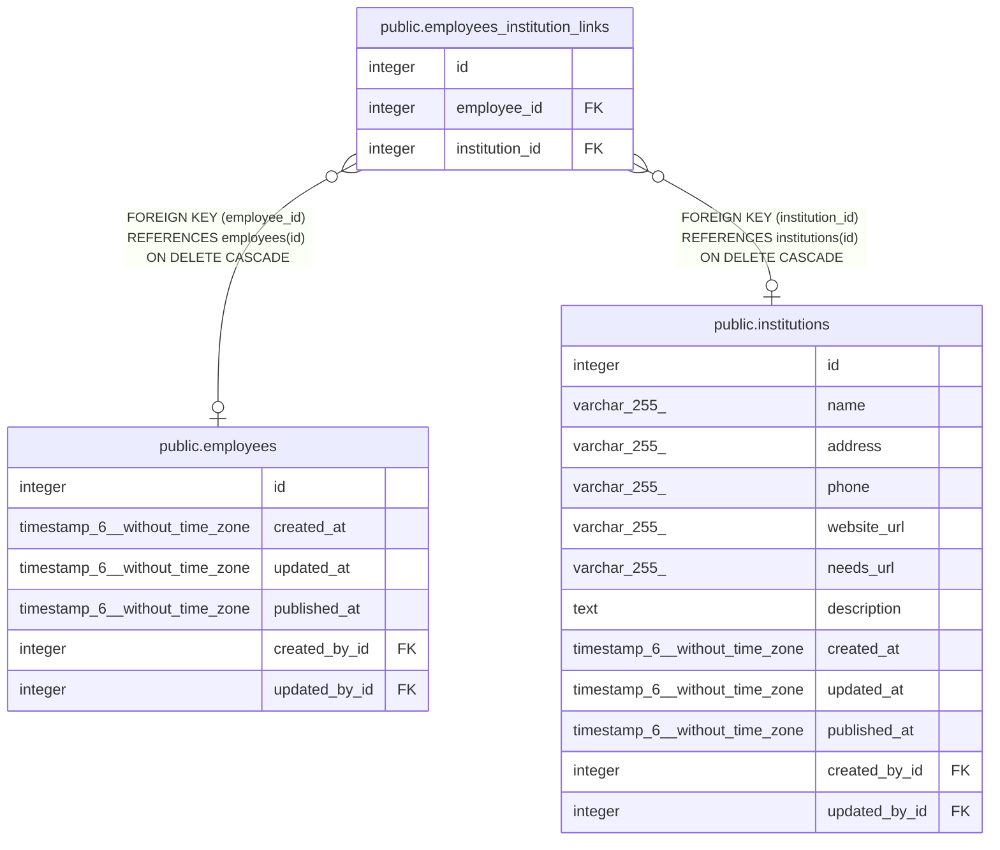

# public.employees_institution_links

## Description

## Columns

| Name | Type | Default | Nullable | Children | Parents | Comment |
| ---- | ---- | ------- | -------- | -------- | ------- | ------- |
| id | integer | nextval('employees_institution_links_id_seq'::regclass) | false |  |  |  |
| employee_id | integer |  | true |  | [public.employees](public.employees.md) |  |
| institution_id | integer |  | true |  | [public.institutions](public.institutions.md) |  |

## Constraints

| Name | Type | Definition |
| ---- | ---- | ---------- |
| employees_institution_links_fk | FOREIGN KEY | FOREIGN KEY (employee_id) REFERENCES employees(id) ON DELETE CASCADE |
| employees_institution_links_inv_fk | FOREIGN KEY | FOREIGN KEY (institution_id) REFERENCES institutions(id) ON DELETE CASCADE |
| employees_institution_links_pkey | PRIMARY KEY | PRIMARY KEY (id) |
| employees_institution_links_unique | UNIQUE | UNIQUE (employee_id, institution_id) |

## Indexes

| Name | Definition |
| ---- | ---------- |
| employees_institution_links_pkey | CREATE UNIQUE INDEX employees_institution_links_pkey ON public.employees_institution_links USING btree (id) |
| employees_institution_links_fk | CREATE INDEX employees_institution_links_fk ON public.employees_institution_links USING btree (employee_id) |
| employees_institution_links_inv_fk | CREATE INDEX employees_institution_links_inv_fk ON public.employees_institution_links USING btree (institution_id) |
| employees_institution_links_unique | CREATE UNIQUE INDEX employees_institution_links_unique ON public.employees_institution_links USING btree (employee_id, institution_id) |

## Relations

---

> Generated by [tbls](https://github.com/k1LoW/tbls)
