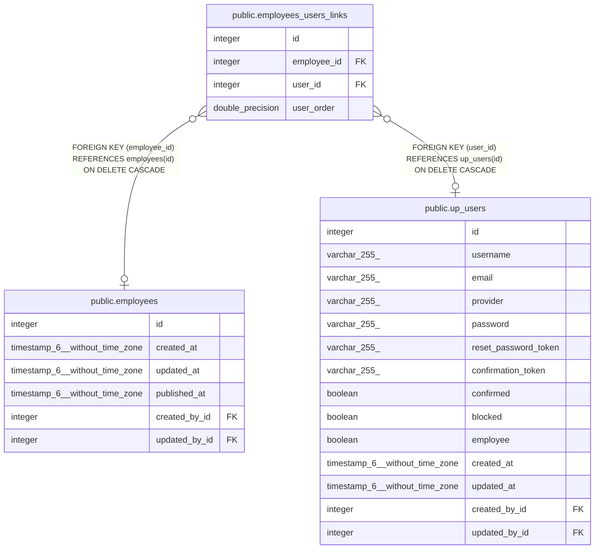

# public.employees_users_links

## Description

## Columns

| Name        | Type             | Default                                           | Nullable | Children | Parents                                 | Comment |
| ----------- | ---------------- | ------------------------------------------------- | -------- | -------- | --------------------------------------- | ------- |
| id          | integer          | nextval('employees_users_links_id_seq'::regclass) | false    |          |                                         |         |
| employee_id | integer          |                                                   | true     |          | [public.employees](public.employees.md) |         |
| user_id     | integer          |                                                   | true     |          | [public.up_users](public.up_users.md)   |         |
| user_order  | double precision |                                                   | true     |          |                                         |         |

## Constraints

| Name                         | Type        | Definition                                                           |
| ---------------------------- | ----------- | -------------------------------------------------------------------- |
| employees_users_links_inv_fk | FOREIGN KEY | FOREIGN KEY (user_id) REFERENCES up_users(id) ON DELETE CASCADE      |
| employees_users_links_fk     | FOREIGN KEY | FOREIGN KEY (employee_id) REFERENCES employees(id) ON DELETE CASCADE |
| employees_users_links_pkey   | PRIMARY KEY | PRIMARY KEY (id)                                                     |
| employees_users_links_unique | UNIQUE      | UNIQUE (employee_id, user_id)                                        |

## Indexes

| Name                           | Definition                                                                                                          |
| ------------------------------ | ------------------------------------------------------------------------------------------------------------------- |
| employees_users_links_pkey     | CREATE UNIQUE INDEX employees_users_links_pkey ON public.employees_users_links USING btree (id)                     |
| employees_users_links_fk       | CREATE INDEX employees_users_links_fk ON public.employees_users_links USING btree (employee_id)                     |
| employees_users_links_inv_fk   | CREATE INDEX employees_users_links_inv_fk ON public.employees_users_links USING btree (user_id)                     |
| employees_users_links_unique   | CREATE UNIQUE INDEX employees_users_links_unique ON public.employees_users_links USING btree (employee_id, user_id) |
| employees_users_links_order_fk | CREATE INDEX employees_users_links_order_fk ON public.employees_users_links USING btree (user_order)                |

## Relations

---

> Generated by [tbls](https://github.com/k1LoW/tbls)
