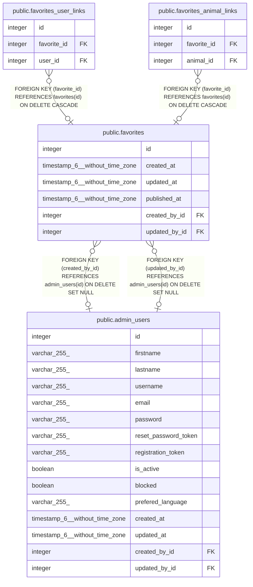

# public.favorites

## Description

## Columns

| Name          | Type                           | Default                               | Nullable | Children                                                                                                                        | Parents                                     | Comment |
| ------------- | ------------------------------ | ------------------------------------- | -------- | ------------------------------------------------------------------------------------------------------------------------------- | ------------------------------------------- | ------- |
| id            | integer                        | nextval('favorites_id_seq'::regclass) | false    | [public.favorites_user_links](public.favorites_user_links.md) [public.favorites_animal_links](public.favorites_animal_links.md) |                                             |         |
| created_at    | timestamp(6) without time zone |                                       | true     |                                                                                                                                 |                                             |         |
| updated_at    | timestamp(6) without time zone |                                       | true     |                                                                                                                                 |                                             |         |
| published_at  | timestamp(6) without time zone |                                       | true     |                                                                                                                                 |                                             |         |
| created_by_id | integer                        |                                       | true     |                                                                                                                                 | [public.admin_users](public.admin_users.md) |         |
| updated_by_id | integer                        |                                       | true     |                                                                                                                                 | [public.admin_users](public.admin_users.md) |         |

## Constraints

| Name                       | Type        | Definition                                                                |
| -------------------------- | ----------- | ------------------------------------------------------------------------- |
| favorites_created_by_id_fk | FOREIGN KEY | FOREIGN KEY (created_by_id) REFERENCES admin_users(id) ON DELETE SET NULL |
| favorites_updated_by_id_fk | FOREIGN KEY | FOREIGN KEY (updated_by_id) REFERENCES admin_users(id) ON DELETE SET NULL |
| favorites_pkey             | PRIMARY KEY | PRIMARY KEY (id)                                                          |

## Indexes

| Name                       | Definition                                                                              |
| -------------------------- | --------------------------------------------------------------------------------------- |
| favorites_pkey             | CREATE UNIQUE INDEX favorites_pkey ON public.favorites USING btree (id)                 |
| favorites_created_by_id_fk | CREATE INDEX favorites_created_by_id_fk ON public.favorites USING btree (created_by_id) |
| favorites_updated_by_id_fk | CREATE INDEX favorites_updated_by_id_fk ON public.favorites USING btree (updated_by_id) |

## Relations

---

> Generated by [tbls](https://github.com/k1LoW/tbls)
