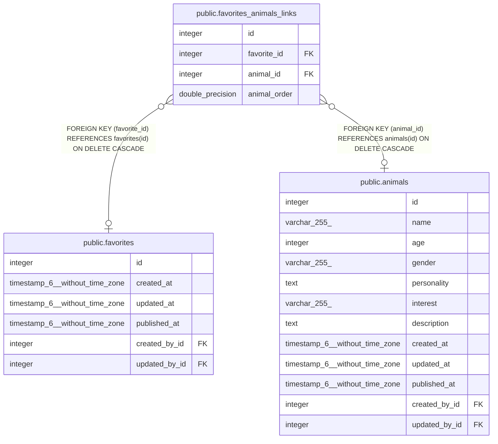

# public.favorites_animals_links

## Description

## Columns

| Name         | Type             | Default                                             | Nullable | Children | Parents                                 | Comment |
| ------------ | ---------------- | --------------------------------------------------- | -------- | -------- | --------------------------------------- | ------- |
| id           | integer          | nextval('favorites_animals_links_id_seq'::regclass) | false    |          |                                         |         |
| favorite_id  | integer          |                                                     | true     |          | [public.favorites](public.favorites.md) |         |
| animal_id    | integer          |                                                     | true     |          | [public.animals](public.animals.md)     |         |
| animal_order | double precision |                                                     | true     |          |                                         |         |

## Constraints

| Name                           | Type        | Definition                                                           |
| ------------------------------ | ----------- | -------------------------------------------------------------------- |
| favorites_animals_links_inv_fk | FOREIGN KEY | FOREIGN KEY (animal_id) REFERENCES animals(id) ON DELETE CASCADE     |
| favorites_animals_links_fk     | FOREIGN KEY | FOREIGN KEY (favorite_id) REFERENCES favorites(id) ON DELETE CASCADE |
| favorites_animals_links_pkey   | PRIMARY KEY | PRIMARY KEY (id)                                                     |
| favorites_animals_links_unique | UNIQUE      | UNIQUE (favorite_id, animal_id)                                      |

## Indexes

| Name                             | Definition                                                                                                                |
| -------------------------------- | ------------------------------------------------------------------------------------------------------------------------- |
| favorites_animals_links_pkey     | CREATE UNIQUE INDEX favorites_animals_links_pkey ON public.favorites_animals_links USING btree (id)                       |
| favorites_animals_links_fk       | CREATE INDEX favorites_animals_links_fk ON public.favorites_animals_links USING btree (favorite_id)                       |
| favorites_animals_links_inv_fk   | CREATE INDEX favorites_animals_links_inv_fk ON public.favorites_animals_links USING btree (animal_id)                     |
| favorites_animals_links_unique   | CREATE UNIQUE INDEX favorites_animals_links_unique ON public.favorites_animals_links USING btree (favorite_id, animal_id) |
| favorites_animals_links_order_fk | CREATE INDEX favorites_animals_links_order_fk ON public.favorites_animals_links USING btree (animal_order)                |

## Relations

---

> Generated by [tbls](https://github.com/k1LoW/tbls)
