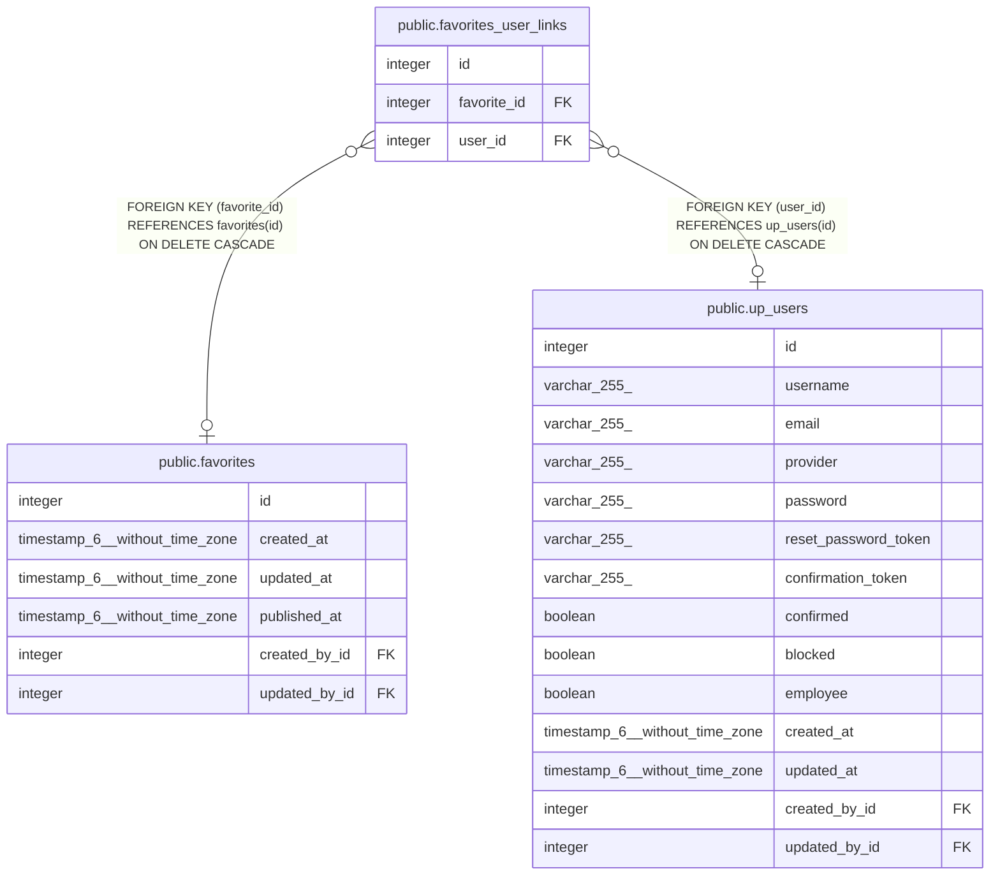

# public.favorites_user_links

## Description

## Columns

| Name | Type | Default | Nullable | Children | Parents | Comment |
| ---- | ---- | ------- | -------- | -------- | ------- | ------- |
| id | integer | nextval('favorites_user_links_id_seq'::regclass) | false |  |  |  |
| favorite_id | integer |  | true |  | [public.favorites](public.favorites.md) |  |
| user_id | integer |  | true |  | [public.up_users](public.up_users.md) |  |

## Constraints

| Name | Type | Definition |
| ---- | ---- | ---------- |
| favorites_user_links_inv_fk | FOREIGN KEY | FOREIGN KEY (user_id) REFERENCES up_users(id) ON DELETE CASCADE |
| favorites_user_links_fk | FOREIGN KEY | FOREIGN KEY (favorite_id) REFERENCES favorites(id) ON DELETE CASCADE |
| favorites_user_links_pkey | PRIMARY KEY | PRIMARY KEY (id) |
| favorites_user_links_unique | UNIQUE | UNIQUE (favorite_id, user_id) |

## Indexes

| Name | Definition |
| ---- | ---------- |
| favorites_user_links_pkey | CREATE UNIQUE INDEX favorites_user_links_pkey ON public.favorites_user_links USING btree (id) |
| favorites_user_links_fk | CREATE INDEX favorites_user_links_fk ON public.favorites_user_links USING btree (favorite_id) |
| favorites_user_links_inv_fk | CREATE INDEX favorites_user_links_inv_fk ON public.favorites_user_links USING btree (user_id) |
| favorites_user_links_unique | CREATE UNIQUE INDEX favorites_user_links_unique ON public.favorites_user_links USING btree (favorite_id, user_id) |

## Relations

---

> Generated by [tbls](https://github.com/k1LoW/tbls)
