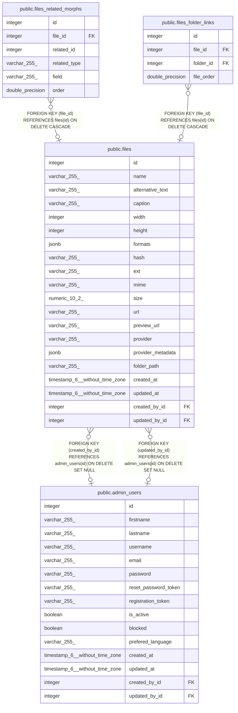

# public.files

## Description

## Columns

| Name | Type | Default | Nullable | Children | Parents | Comment |
| ---- | ---- | ------- | -------- | -------- | ------- | ------- |
| id | integer | nextval('files_id_seq'::regclass) | false | [public.files_related_morphs](public.files_related_morphs.md) [public.files_folder_links](public.files_folder_links.md) |  |  |
| name | varchar(255) |  | true |  |  |  |
| alternative_text | varchar(255) |  | true |  |  |  |
| caption | varchar(255) |  | true |  |  |  |
| width | integer |  | true |  |  |  |
| height | integer |  | true |  |  |  |
| formats | jsonb |  | true |  |  |  |
| hash | varchar(255) |  | true |  |  |  |
| ext | varchar(255) |  | true |  |  |  |
| mime | varchar(255) |  | true |  |  |  |
| size | numeric(10,2) |  | true |  |  |  |
| url | varchar(255) |  | true |  |  |  |
| preview_url | varchar(255) |  | true |  |  |  |
| provider | varchar(255) |  | true |  |  |  |
| provider_metadata | jsonb |  | true |  |  |  |
| folder_path | varchar(255) |  | true |  |  |  |
| created_at | timestamp(6) without time zone |  | true |  |  |  |
| updated_at | timestamp(6) without time zone |  | true |  |  |  |
| created_by_id | integer |  | true |  | [public.admin_users](public.admin_users.md) |  |
| updated_by_id | integer |  | true |  | [public.admin_users](public.admin_users.md) |  |

## Constraints

| Name | Type | Definition |
| ---- | ---- | ---------- |
| files_created_by_id_fk | FOREIGN KEY | FOREIGN KEY (created_by_id) REFERENCES admin_users(id) ON DELETE SET NULL |
| files_updated_by_id_fk | FOREIGN KEY | FOREIGN KEY (updated_by_id) REFERENCES admin_users(id) ON DELETE SET NULL |
| files_pkey | PRIMARY KEY | PRIMARY KEY (id) |

## Indexes

| Name | Definition |
| ---- | ---------- |
| files_pkey | CREATE UNIQUE INDEX files_pkey ON public.files USING btree (id) |
| upload_files_folder_path_index | CREATE INDEX upload_files_folder_path_index ON public.files USING btree (folder_path) |
| upload_files_created_at_index | CREATE INDEX upload_files_created_at_index ON public.files USING btree (created_at) |
| upload_files_updated_at_index | CREATE INDEX upload_files_updated_at_index ON public.files USING btree (updated_at) |
| upload_files_name_index | CREATE INDEX upload_files_name_index ON public.files USING btree (name) |
| upload_files_size_index | CREATE INDEX upload_files_size_index ON public.files USING btree (size) |
| upload_files_ext_index | CREATE INDEX upload_files_ext_index ON public.files USING btree (ext) |
| files_created_by_id_fk | CREATE INDEX files_created_by_id_fk ON public.files USING btree (created_by_id) |
| files_updated_by_id_fk | CREATE INDEX files_updated_by_id_fk ON public.files USING btree (updated_by_id) |

## Relations

---

> Generated by [tbls](https://github.com/k1LoW/tbls)
