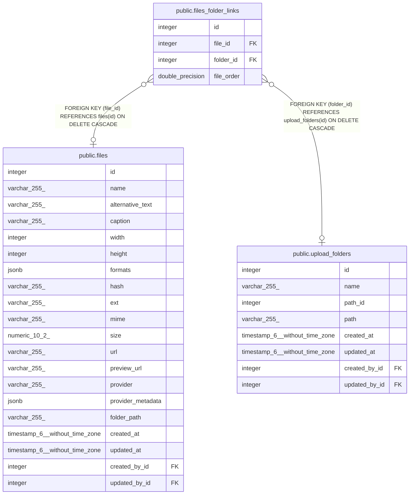

# public.files_folder_links

## Description

## Columns

| Name       | Type             | Default                                        | Nullable | Children | Parents                                           | Comment |
| ---------- | ---------------- | ---------------------------------------------- | -------- | -------- | ------------------------------------------------- | ------- |
| id         | integer          | nextval('files_folder_links_id_seq'::regclass) | false    |          |                                                   |         |
| file_id    | integer          |                                                | true     |          | [public.files](public.files.md)                   |         |
| folder_id  | integer          |                                                | true     |          | [public.upload_folders](public.upload_folders.md) |         |
| file_order | double precision |                                                | true     |          |                                                   |         |

## Constraints

| Name                      | Type        | Definition                                                              |
| ------------------------- | ----------- | ----------------------------------------------------------------------- |
| files_folder_links_fk     | FOREIGN KEY | FOREIGN KEY (file_id) REFERENCES files(id) ON DELETE CASCADE            |
| files_folder_links_inv_fk | FOREIGN KEY | FOREIGN KEY (folder_id) REFERENCES upload_folders(id) ON DELETE CASCADE |
| files_folder_links_pkey   | PRIMARY KEY | PRIMARY KEY (id)                                                        |
| files_folder_links_unique | UNIQUE      | UNIQUE (file_id, folder_id)                                             |

## Indexes

| Name                            | Definition                                                                                                  |
| ------------------------------- | ----------------------------------------------------------------------------------------------------------- |
| files_folder_links_pkey         | CREATE UNIQUE INDEX files_folder_links_pkey ON public.files_folder_links USING btree (id)                   |
| files_folder_links_fk           | CREATE INDEX files_folder_links_fk ON public.files_folder_links USING btree (file_id)                       |
| files_folder_links_inv_fk       | CREATE INDEX files_folder_links_inv_fk ON public.files_folder_links USING btree (folder_id)                 |
| files_folder_links_unique       | CREATE UNIQUE INDEX files_folder_links_unique ON public.files_folder_links USING btree (file_id, folder_id) |
| files_folder_links_order_inv_fk | CREATE INDEX files_folder_links_order_inv_fk ON public.files_folder_links USING btree (file_order)          |

## Relations

---

> Generated by [tbls](https://github.com/k1LoW/tbls)
