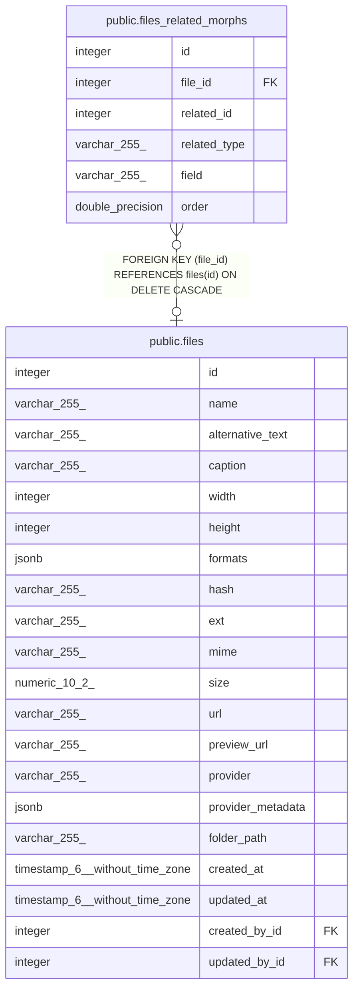

# public.files_related_morphs

## Description

## Columns

| Name | Type | Default | Nullable | Children | Parents | Comment |
| ---- | ---- | ------- | -------- | -------- | ------- | ------- |
| id | integer | nextval('files_related_morphs_id_seq'::regclass) | false |  |  |  |
| file_id | integer |  | true |  | [public.files](public.files.md) |  |
| related_id | integer |  | true |  |  |  |
| related_type | varchar(255) |  | true |  |  |  |
| field | varchar(255) |  | true |  |  |  |
| order | double precision |  | true |  |  |  |

## Constraints

| Name | Type | Definition |
| ---- | ---- | ---------- |
| files_related_morphs_fk | FOREIGN KEY | FOREIGN KEY (file_id) REFERENCES files(id) ON DELETE CASCADE |
| files_related_morphs_pkey | PRIMARY KEY | PRIMARY KEY (id) |

## Indexes

| Name | Definition |
| ---- | ---------- |
| files_related_morphs_pkey | CREATE UNIQUE INDEX files_related_morphs_pkey ON public.files_related_morphs USING btree (id) |
| files_related_morphs_fk | CREATE INDEX files_related_morphs_fk ON public.files_related_morphs USING btree (file_id) |
| files_related_morphs_order_index | CREATE INDEX files_related_morphs_order_index ON public.files_related_morphs USING btree ("order") |
| files_related_morphs_id_column_index | CREATE INDEX files_related_morphs_id_column_index ON public.files_related_morphs USING btree (related_id) |

## Relations

---

> Generated by [tbls](https://github.com/k1LoW/tbls)
