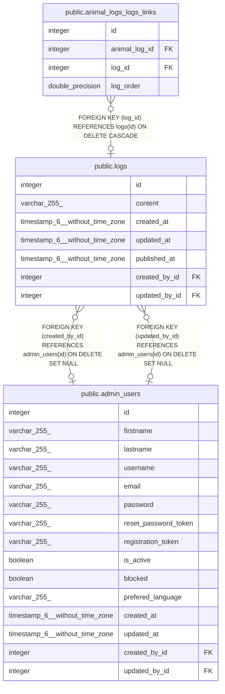

# public.logs

## Description

## Columns

| Name          | Type                           | Default                          | Nullable | Children                                                          | Parents                                     | Comment |
| ------------- | ------------------------------ | -------------------------------- | -------- | ----------------------------------------------------------------- | ------------------------------------------- | ------- |
| id            | integer                        | nextval('logs_id_seq'::regclass) | false    | [public.animal_logs_logs_links](public.animal_logs_logs_links.md) |                                             |         |
| content       | varchar(255)                   |                                  | true     |                                                                   |                                             |         |
| created_at    | timestamp(6) without time zone |                                  | true     |                                                                   |                                             |         |
| updated_at    | timestamp(6) without time zone |                                  | true     |                                                                   |                                             |         |
| published_at  | timestamp(6) without time zone |                                  | true     |                                                                   |                                             |         |
| created_by_id | integer                        |                                  | true     |                                                                   | [public.admin_users](public.admin_users.md) |         |
| updated_by_id | integer                        |                                  | true     |                                                                   | [public.admin_users](public.admin_users.md) |         |

## Constraints

| Name                  | Type        | Definition                                                                |
| --------------------- | ----------- | ------------------------------------------------------------------------- |
| logs_created_by_id_fk | FOREIGN KEY | FOREIGN KEY (created_by_id) REFERENCES admin_users(id) ON DELETE SET NULL |
| logs_updated_by_id_fk | FOREIGN KEY | FOREIGN KEY (updated_by_id) REFERENCES admin_users(id) ON DELETE SET NULL |
| logs_pkey             | PRIMARY KEY | PRIMARY KEY (id)                                                          |

## Indexes

| Name                  | Definition                                                                    |
| --------------------- | ----------------------------------------------------------------------------- |
| logs_pkey             | CREATE UNIQUE INDEX logs_pkey ON public.logs USING btree (id)                 |
| logs_created_by_id_fk | CREATE INDEX logs_created_by_id_fk ON public.logs USING btree (created_by_id) |
| logs_updated_by_id_fk | CREATE INDEX logs_updated_by_id_fk ON public.logs USING btree (updated_by_id) |

## Relations

---

> Generated by [tbls](https://github.com/k1LoW/tbls)
