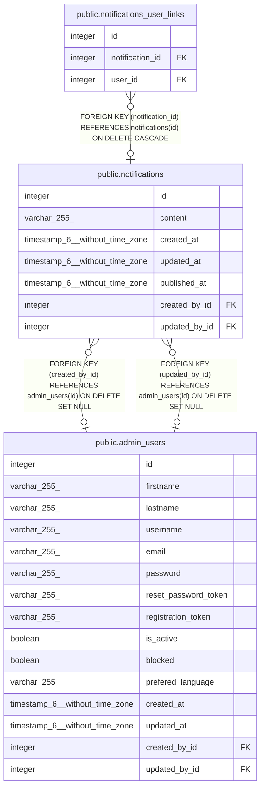

# public.notifications

## Description

## Columns

| Name          | Type                           | Default                                   | Nullable | Children                                                              | Parents                                     | Comment |
| ------------- | ------------------------------ | ----------------------------------------- | -------- | --------------------------------------------------------------------- | ------------------------------------------- | ------- |
| id            | integer                        | nextval('notifications_id_seq'::regclass) | false    | [public.notifications_user_links](public.notifications_user_links.md) |                                             |         |
| content       | varchar(255)                   |                                           | true     |                                                                       |                                             |         |
| created_at    | timestamp(6) without time zone |                                           | true     |                                                                       |                                             |         |
| updated_at    | timestamp(6) without time zone |                                           | true     |                                                                       |                                             |         |
| published_at  | timestamp(6) without time zone |                                           | true     |                                                                       |                                             |         |
| created_by_id | integer                        |                                           | true     |                                                                       | [public.admin_users](public.admin_users.md) |         |
| updated_by_id | integer                        |                                           | true     |                                                                       | [public.admin_users](public.admin_users.md) |         |

## Constraints

| Name                           | Type        | Definition                                                                |
| ------------------------------ | ----------- | ------------------------------------------------------------------------- |
| notifications_created_by_id_fk | FOREIGN KEY | FOREIGN KEY (created_by_id) REFERENCES admin_users(id) ON DELETE SET NULL |
| notifications_updated_by_id_fk | FOREIGN KEY | FOREIGN KEY (updated_by_id) REFERENCES admin_users(id) ON DELETE SET NULL |
| notifications_pkey             | PRIMARY KEY | PRIMARY KEY (id)                                                          |

## Indexes

| Name                           | Definition                                                                                      |
| ------------------------------ | ----------------------------------------------------------------------------------------------- |
| notifications_pkey             | CREATE UNIQUE INDEX notifications_pkey ON public.notifications USING btree (id)                 |
| notifications_created_by_id_fk | CREATE INDEX notifications_created_by_id_fk ON public.notifications USING btree (created_by_id) |
| notifications_updated_by_id_fk | CREATE INDEX notifications_updated_by_id_fk ON public.notifications USING btree (updated_by_id) |

## Relations

---

> Generated by [tbls](https://github.com/k1LoW/tbls)
