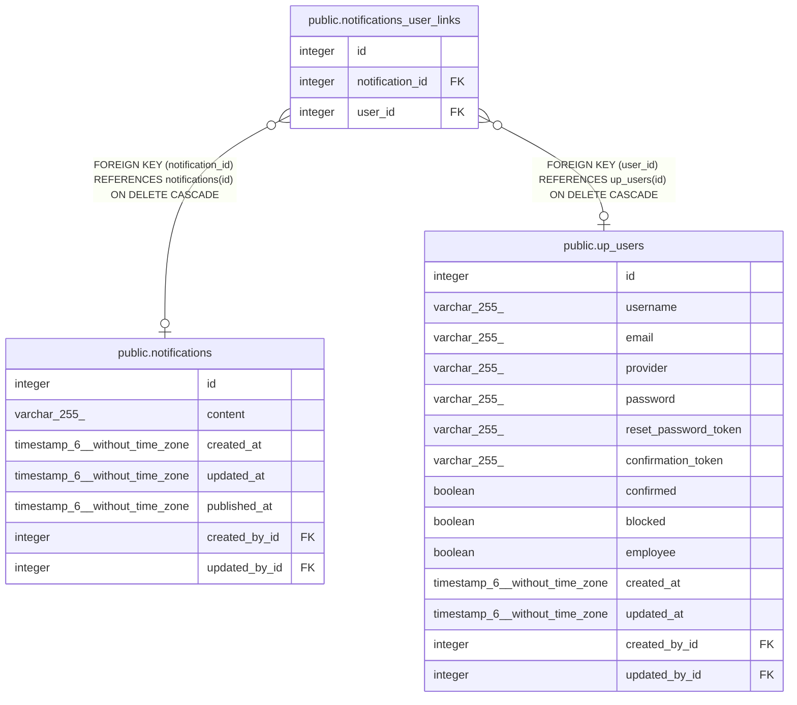

# public.notifications_user_links

## Description

## Columns

| Name            | Type    | Default                                              | Nullable | Children | Parents                                         | Comment |
| --------------- | ------- | ---------------------------------------------------- | -------- | -------- | ----------------------------------------------- | ------- |
| id              | integer | nextval('notifications_user_links_id_seq'::regclass) | false    |          |                                                 |         |
| notification_id | integer |                                                      | true     |          | [public.notifications](public.notifications.md) |         |
| user_id         | integer |                                                      | true     |          | [public.up_users](public.up_users.md)           |         |

## Constraints

| Name                            | Type        | Definition                                                                   |
| ------------------------------- | ----------- | ---------------------------------------------------------------------------- |
| notifications_user_links_inv_fk | FOREIGN KEY | FOREIGN KEY (user_id) REFERENCES up_users(id) ON DELETE CASCADE              |
| notifications_user_links_fk     | FOREIGN KEY | FOREIGN KEY (notification_id) REFERENCES notifications(id) ON DELETE CASCADE |
| notifications_user_links_pkey   | PRIMARY KEY | PRIMARY KEY (id)                                                             |
| notifications_user_links_unique | UNIQUE      | UNIQUE (notification_id, user_id)                                            |

## Indexes

| Name                            | Definition                                                                                                                    |
| ------------------------------- | ----------------------------------------------------------------------------------------------------------------------------- |
| notifications_user_links_pkey   | CREATE UNIQUE INDEX notifications_user_links_pkey ON public.notifications_user_links USING btree (id)                         |
| notifications_user_links_fk     | CREATE INDEX notifications_user_links_fk ON public.notifications_user_links USING btree (notification_id)                     |
| notifications_user_links_inv_fk | CREATE INDEX notifications_user_links_inv_fk ON public.notifications_user_links USING btree (user_id)                         |
| notifications_user_links_unique | CREATE UNIQUE INDEX notifications_user_links_unique ON public.notifications_user_links USING btree (notification_id, user_id) |

## Relations

---

> Generated by [tbls](https://github.com/k1LoW/tbls)
