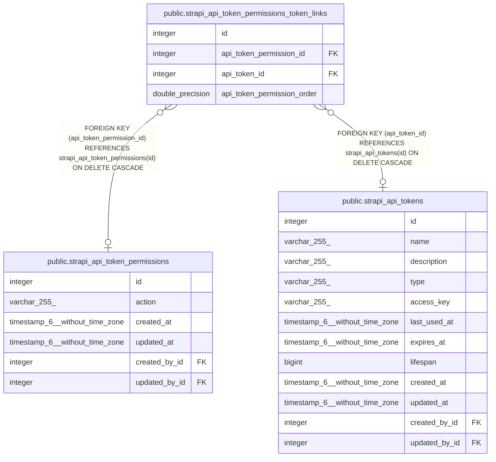

# public.strapi_api_token_permissions_token_links

## Description

## Columns

| Name                       | Type             | Default                                                              | Nullable | Children | Parents                                                                       | Comment |
| -------------------------- | ---------------- | -------------------------------------------------------------------- | -------- | -------- | ----------------------------------------------------------------------------- | ------- |
| id                         | integer          | nextval('strapi_api_token_permissions_token_links_id_seq'::regclass) | false    |          |                                                                               |         |
| api_token_permission_id    | integer          |                                                                      | true     |          | [public.strapi_api_token_permissions](public.strapi_api_token_permissions.md) |         |
| api_token_id               | integer          |                                                                      | true     |          | [public.strapi_api_tokens](public.strapi_api_tokens.md)                       |         |
| api_token_permission_order | double precision |                                                                      | true     |          |                                                                               |         |

## Constraints

| Name                                            | Type        | Definition                                                                                          |
| ----------------------------------------------- | ----------- | --------------------------------------------------------------------------------------------------- |
| strapi_api_token_permissions_token_links_inv_fk | FOREIGN KEY | FOREIGN KEY (api_token_id) REFERENCES strapi_api_tokens(id) ON DELETE CASCADE                       |
| strapi_api_token_permissions_token_links_fk     | FOREIGN KEY | FOREIGN KEY (api_token_permission_id) REFERENCES strapi_api_token_permissions(id) ON DELETE CASCADE |
| strapi_api_token_permissions_token_links_pkey   | PRIMARY KEY | PRIMARY KEY (id)                                                                                    |
| strapi_api_token_permissions_token_links_unique | UNIQUE      | UNIQUE (api_token_permission_id, api_token_id)                                                      |

## Indexes

| Name                                                  | Definition                                                                                                                                                                 |
| ----------------------------------------------------- | -------------------------------------------------------------------------------------------------------------------------------------------------------------------------- |
| strapi_api_token_permissions_token_links_pkey         | CREATE UNIQUE INDEX strapi_api_token_permissions_token_links_pkey ON public.strapi_api_token_permissions_token_links USING btree (id)                                      |
| strapi_api_token_permissions_token_links_fk           | CREATE INDEX strapi_api_token_permissions_token_links_fk ON public.strapi_api_token_permissions_token_links USING btree (api_token_permission_id)                          |
| strapi_api_token_permissions_token_links_inv_fk       | CREATE INDEX strapi_api_token_permissions_token_links_inv_fk ON public.strapi_api_token_permissions_token_links USING btree (api_token_id)                                 |
| strapi_api_token_permissions_token_links_unique       | CREATE UNIQUE INDEX strapi_api_token_permissions_token_links_unique ON public.strapi_api_token_permissions_token_links USING btree (api_token_permission_id, api_token_id) |
| strapi_api_token_permissions_token_links_order_inv_fk | CREATE INDEX strapi_api_token_permissions_token_links_order_inv_fk ON public.strapi_api_token_permissions_token_links USING btree (api_token_permission_order)             |

## Relations

---

> Generated by [tbls](https://github.com/k1LoW/tbls)
