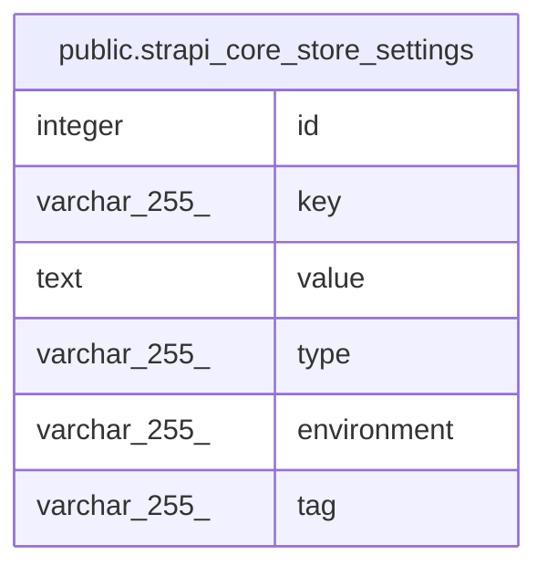

# public.strapi_core_store_settings

## Description

## Columns

| Name | Type | Default | Nullable | Children | Parents | Comment |
| ---- | ---- | ------- | -------- | -------- | ------- | ------- |
| id | integer | nextval('strapi_core_store_settings_id_seq'::regclass) | false |  |  |  |
| key | varchar(255) |  | true |  |  |  |
| value | text |  | true |  |  |  |
| type | varchar(255) |  | true |  |  |  |
| environment | varchar(255) |  | true |  |  |  |
| tag | varchar(255) |  | true |  |  |  |

## Constraints

| Name | Type | Definition |
| ---- | ---- | ---------- |
| strapi_core_store_settings_pkey | PRIMARY KEY | PRIMARY KEY (id) |

## Indexes

| Name | Definition |
| ---- | ---------- |
| strapi_core_store_settings_pkey | CREATE UNIQUE INDEX strapi_core_store_settings_pkey ON public.strapi_core_store_settings USING btree (id) |

## Relations

---

> Generated by [tbls](https://github.com/k1LoW/tbls)
