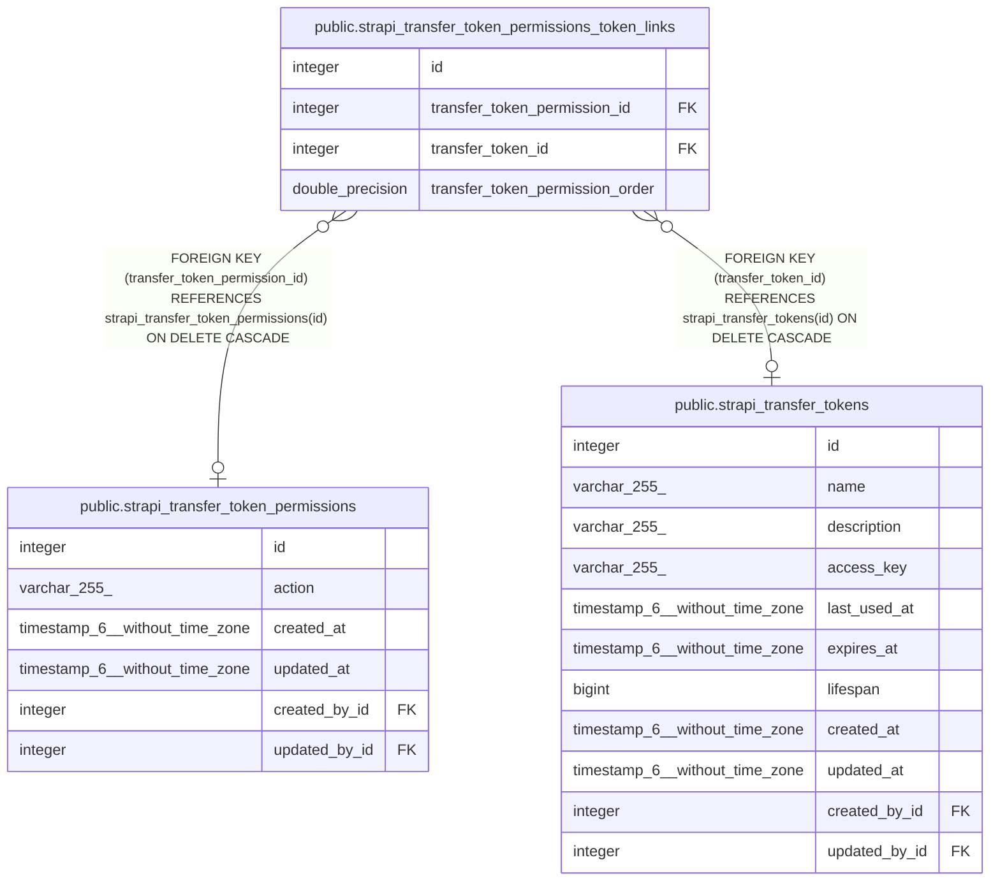

# public.strapi_transfer_token_permissions_token_links

## Description

## Columns

| Name | Type | Default | Nullable | Children | Parents | Comment |
| ---- | ---- | ------- | -------- | -------- | ------- | ------- |
| id | integer | nextval('strapi_transfer_token_permissions_token_links_id_seq'::regclass) | false |  |  |  |
| transfer_token_permission_id | integer |  | true |  | [public.strapi_transfer_token_permissions](public.strapi_transfer_token_permissions.md) |  |
| transfer_token_id | integer |  | true |  | [public.strapi_transfer_tokens](public.strapi_transfer_tokens.md) |  |
| transfer_token_permission_order | double precision |  | true |  |  |  |

## Constraints

| Name | Type | Definition |
| ---- | ---- | ---------- |
| strapi_transfer_token_permissions_token_links_inv_fk | FOREIGN KEY | FOREIGN KEY (transfer_token_id) REFERENCES strapi_transfer_tokens(id) ON DELETE CASCADE |
| strapi_transfer_token_permissions_token_links_fk | FOREIGN KEY | FOREIGN KEY (transfer_token_permission_id) REFERENCES strapi_transfer_token_permissions(id) ON DELETE CASCADE |
| strapi_transfer_token_permissions_token_links_pkey | PRIMARY KEY | PRIMARY KEY (id) |
| strapi_transfer_token_permissions_token_links_unique | UNIQUE | UNIQUE (transfer_token_permission_id, transfer_token_id) |

## Indexes

| Name | Definition |
| ---- | ---------- |
| strapi_transfer_token_permissions_token_links_pkey | CREATE UNIQUE INDEX strapi_transfer_token_permissions_token_links_pkey ON public.strapi_transfer_token_permissions_token_links USING btree (id) |
| strapi_transfer_token_permissions_token_links_fk | CREATE INDEX strapi_transfer_token_permissions_token_links_fk ON public.strapi_transfer_token_permissions_token_links USING btree (transfer_token_permission_id) |
| strapi_transfer_token_permissions_token_links_inv_fk | CREATE INDEX strapi_transfer_token_permissions_token_links_inv_fk ON public.strapi_transfer_token_permissions_token_links USING btree (transfer_token_id) |
| strapi_transfer_token_permissions_token_links_unique | CREATE UNIQUE INDEX strapi_transfer_token_permissions_token_links_unique ON public.strapi_transfer_token_permissions_token_links USING btree (transfer_token_permission_id, transfer_token_id) |
| strapi_transfer_token_permissions_token_links_order_inv_fk | CREATE INDEX strapi_transfer_token_permissions_token_links_order_inv_fk ON public.strapi_transfer_token_permissions_token_links USING btree (transfer_token_permission_order) |

## Relations

---

> Generated by [tbls](https://github.com/k1LoW/tbls)
