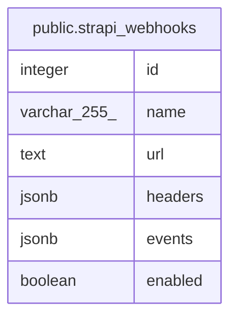

# public.strapi_webhooks

## Description

## Columns

| Name    | Type         | Default                                     | Nullable | Children | Parents | Comment |
| ------- | ------------ | ------------------------------------------- | -------- | -------- | ------- | ------- |
| id      | integer      | nextval('strapi_webhooks_id_seq'::regclass) | false    |          |         |         |
| name    | varchar(255) |                                             | true     |          |         |         |
| url     | text         |                                             | true     |          |         |         |
| headers | jsonb        |                                             | true     |          |         |         |
| events  | jsonb        |                                             | true     |          |         |         |
| enabled | boolean      |                                             | true     |          |         |         |

## Constraints

| Name                 | Type        | Definition       |
| -------------------- | ----------- | ---------------- |
| strapi_webhooks_pkey | PRIMARY KEY | PRIMARY KEY (id) |

## Indexes

| Name                 | Definition                                                                          |
| -------------------- | ----------------------------------------------------------------------------------- |
| strapi_webhooks_pkey | CREATE UNIQUE INDEX strapi_webhooks_pkey ON public.strapi_webhooks USING btree (id) |

## Relations

---

> Generated by [tbls](https://github.com/k1LoW/tbls)
