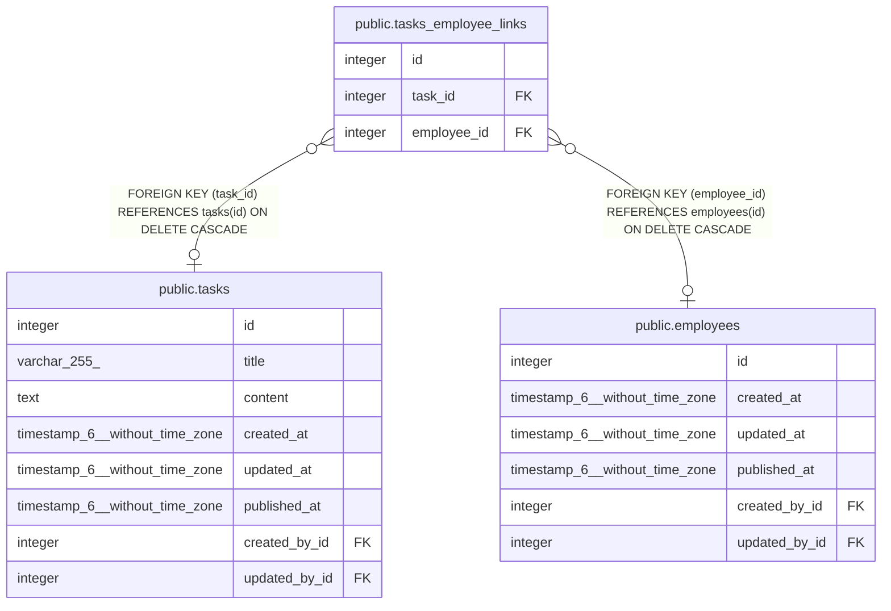

# public.tasks_employee_links

## Description

## Columns

| Name        | Type    | Default                                          | Nullable | Children | Parents                                 | Comment |
| ----------- | ------- | ------------------------------------------------ | -------- | -------- | --------------------------------------- | ------- |
| id          | integer | nextval('tasks_employee_links_id_seq'::regclass) | false    |          |                                         |         |
| task_id     | integer |                                                  | true     |          | [public.tasks](public.tasks.md)         |         |
| employee_id | integer |                                                  | true     |          | [public.employees](public.employees.md) |         |

## Constraints

| Name                        | Type        | Definition                                                           |
| --------------------------- | ----------- | -------------------------------------------------------------------- |
| tasks_employee_links_inv_fk | FOREIGN KEY | FOREIGN KEY (employee_id) REFERENCES employees(id) ON DELETE CASCADE |
| tasks_employee_links_fk     | FOREIGN KEY | FOREIGN KEY (task_id) REFERENCES tasks(id) ON DELETE CASCADE         |
| tasks_employee_links_pkey   | PRIMARY KEY | PRIMARY KEY (id)                                                     |
| tasks_employee_links_unique | UNIQUE      | UNIQUE (task_id, employee_id)                                        |

## Indexes

| Name                        | Definition                                                                                                        |
| --------------------------- | ----------------------------------------------------------------------------------------------------------------- |
| tasks_employee_links_pkey   | CREATE UNIQUE INDEX tasks_employee_links_pkey ON public.tasks_employee_links USING btree (id)                     |
| tasks_employee_links_fk     | CREATE INDEX tasks_employee_links_fk ON public.tasks_employee_links USING btree (task_id)                         |
| tasks_employee_links_inv_fk | CREATE INDEX tasks_employee_links_inv_fk ON public.tasks_employee_links USING btree (employee_id)                 |
| tasks_employee_links_unique | CREATE UNIQUE INDEX tasks_employee_links_unique ON public.tasks_employee_links USING btree (task_id, employee_id) |

## Relations

---

> Generated by [tbls](https://github.com/k1LoW/tbls)
