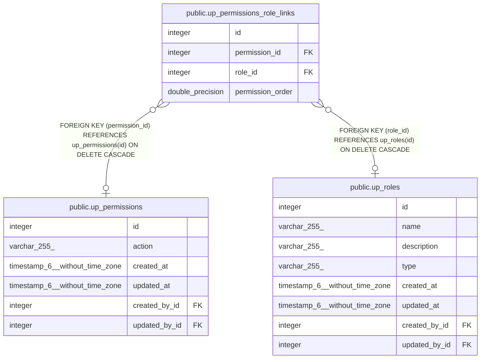

# public.up_permissions_role_links

## Description

## Columns

| Name             | Type             | Default                                               | Nullable | Children | Parents                                           | Comment |
| ---------------- | ---------------- | ----------------------------------------------------- | -------- | -------- | ------------------------------------------------- | ------- |
| id               | integer          | nextval('up_permissions_role_links_id_seq'::regclass) | false    |          |                                                   |         |
| permission_id    | integer          |                                                       | true     |          | [public.up_permissions](public.up_permissions.md) |         |
| role_id          | integer          |                                                       | true     |          | [public.up_roles](public.up_roles.md)             |         |
| permission_order | double precision |                                                       | true     |          |                                                   |         |

## Constraints

| Name                             | Type        | Definition                                                                  |
| -------------------------------- | ----------- | --------------------------------------------------------------------------- |
| up_permissions_role_links_fk     | FOREIGN KEY | FOREIGN KEY (permission_id) REFERENCES up_permissions(id) ON DELETE CASCADE |
| up_permissions_role_links_inv_fk | FOREIGN KEY | FOREIGN KEY (role_id) REFERENCES up_roles(id) ON DELETE CASCADE             |
| up_permissions_role_links_pkey   | PRIMARY KEY | PRIMARY KEY (id)                                                            |
| up_permissions_role_links_unique | UNIQUE      | UNIQUE (permission_id, role_id)                                             |

## Indexes

| Name                                   | Definition                                                                                                                    |
| -------------------------------------- | ----------------------------------------------------------------------------------------------------------------------------- |
| up_permissions_role_links_pkey         | CREATE UNIQUE INDEX up_permissions_role_links_pkey ON public.up_permissions_role_links USING btree (id)                       |
| up_permissions_role_links_fk           | CREATE INDEX up_permissions_role_links_fk ON public.up_permissions_role_links USING btree (permission_id)                     |
| up_permissions_role_links_inv_fk       | CREATE INDEX up_permissions_role_links_inv_fk ON public.up_permissions_role_links USING btree (role_id)                       |
| up_permissions_role_links_unique       | CREATE UNIQUE INDEX up_permissions_role_links_unique ON public.up_permissions_role_links USING btree (permission_id, role_id) |
| up_permissions_role_links_order_inv_fk | CREATE INDEX up_permissions_role_links_order_inv_fk ON public.up_permissions_role_links USING btree (permission_order)        |

## Relations

---

> Generated by [tbls](https://github.com/k1LoW/tbls)
