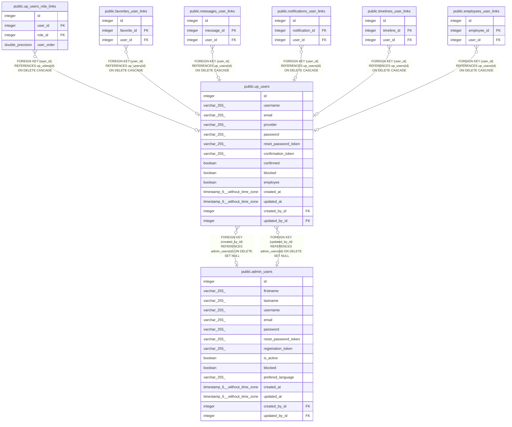

# public.up_users

## Description

## Columns

| Name                 | Type                           | Default                              | Nullable | Children                                                                                                                                                                                                                                                                                                                                                                                | Parents                                     | Comment |
| -------------------- | ------------------------------ | ------------------------------------ | -------- | --------------------------------------------------------------------------------------------------------------------------------------------------------------------------------------------------------------------------------------------------------------------------------------------------------------------------------------------------------------------------------------- | ------------------------------------------- | ------- |
| id                   | integer                        | nextval('up_users_id_seq'::regclass) | false    | [public.up_users_role_links](public.up_users_role_links.md) [public.favorites_user_links](public.favorites_user_links.md) [public.messages_user_links](public.messages_user_links.md) [public.notifications_user_links](public.notifications_user_links.md) [public.timelines_user_links](public.timelines_user_links.md) [public.employees_user_links](public.employees_user_links.md) |                                             |         |
| username             | varchar(255)                   |                                      | true     |                                                                                                                                                                                                                                                                                                                                                                                         |                                             |         |
| email                | varchar(255)                   |                                      | true     |                                                                                                                                                                                                                                                                                                                                                                                         |                                             |         |
| provider             | varchar(255)                   |                                      | true     |                                                                                                                                                                                                                                                                                                                                                                                         |                                             |         |
| password             | varchar(255)                   |                                      | true     |                                                                                                                                                                                                                                                                                                                                                                                         |                                             |         |
| reset_password_token | varchar(255)                   |                                      | true     |                                                                                                                                                                                                                                                                                                                                                                                         |                                             |         |
| confirmation_token   | varchar(255)                   |                                      | true     |                                                                                                                                                                                                                                                                                                                                                                                         |                                             |         |
| confirmed            | boolean                        |                                      | true     |                                                                                                                                                                                                                                                                                                                                                                                         |                                             |         |
| blocked              | boolean                        |                                      | true     |                                                                                                                                                                                                                                                                                                                                                                                         |                                             |         |
| employee             | boolean                        |                                      | true     |                                                                                                                                                                                                                                                                                                                                                                                         |                                             |         |
| created_at           | timestamp(6) without time zone |                                      | true     |                                                                                                                                                                                                                                                                                                                                                                                         |                                             |         |
| updated_at           | timestamp(6) without time zone |                                      | true     |                                                                                                                                                                                                                                                                                                                                                                                         |                                             |         |
| created_by_id        | integer                        |                                      | true     |                                                                                                                                                                                                                                                                                                                                                                                         | [public.admin_users](public.admin_users.md) |         |
| updated_by_id        | integer                        |                                      | true     |                                                                                                                                                                                                                                                                                                                                                                                         | [public.admin_users](public.admin_users.md) |         |

## Constraints

| Name                      | Type        | Definition                                                                |
| ------------------------- | ----------- | ------------------------------------------------------------------------- |
| up_users_created_by_id_fk | FOREIGN KEY | FOREIGN KEY (created_by_id) REFERENCES admin_users(id) ON DELETE SET NULL |
| up_users_updated_by_id_fk | FOREIGN KEY | FOREIGN KEY (updated_by_id) REFERENCES admin_users(id) ON DELETE SET NULL |
| up_users_pkey             | PRIMARY KEY | PRIMARY KEY (id)                                                          |

## Indexes

| Name                      | Definition                                                                            |
| ------------------------- | ------------------------------------------------------------------------------------- |
| up_users_pkey             | CREATE UNIQUE INDEX up_users_pkey ON public.up_users USING btree (id)                 |
| up_users_created_by_id_fk | CREATE INDEX up_users_created_by_id_fk ON public.up_users USING btree (created_by_id) |
| up_users_updated_by_id_fk | CREATE INDEX up_users_updated_by_id_fk ON public.up_users USING btree (updated_by_id) |

## Relations

---

> Generated by [tbls](https://github.com/k1LoW/tbls)
