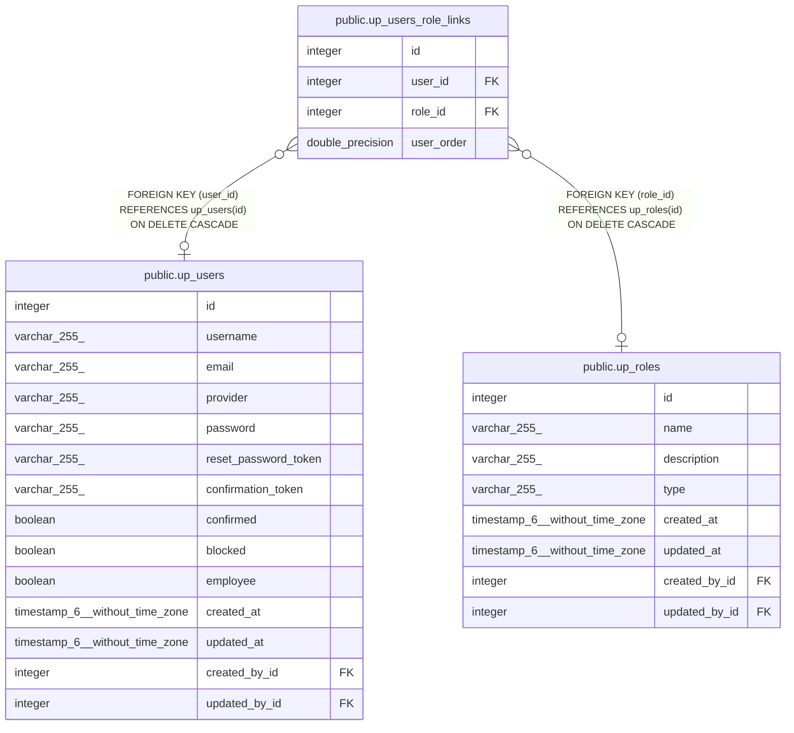

# public.up_users_role_links

## Description

## Columns

| Name | Type | Default | Nullable | Children | Parents | Comment |
| ---- | ---- | ------- | -------- | -------- | ------- | ------- |
| id | integer | nextval('up_users_role_links_id_seq'::regclass) | false |  |  |  |
| user_id | integer |  | true |  | [public.up_users](public.up_users.md) |  |
| role_id | integer |  | true |  | [public.up_roles](public.up_roles.md) |  |
| user_order | double precision |  | true |  |  |  |

## Constraints

| Name | Type | Definition |
| ---- | ---- | ---------- |
| up_users_role_links_inv_fk | FOREIGN KEY | FOREIGN KEY (role_id) REFERENCES up_roles(id) ON DELETE CASCADE |
| up_users_role_links_fk | FOREIGN KEY | FOREIGN KEY (user_id) REFERENCES up_users(id) ON DELETE CASCADE |
| up_users_role_links_pkey | PRIMARY KEY | PRIMARY KEY (id) |
| up_users_role_links_unique | UNIQUE | UNIQUE (user_id, role_id) |

## Indexes

| Name | Definition |
| ---- | ---------- |
| up_users_role_links_pkey | CREATE UNIQUE INDEX up_users_role_links_pkey ON public.up_users_role_links USING btree (id) |
| up_users_role_links_fk | CREATE INDEX up_users_role_links_fk ON public.up_users_role_links USING btree (user_id) |
| up_users_role_links_inv_fk | CREATE INDEX up_users_role_links_inv_fk ON public.up_users_role_links USING btree (role_id) |
| up_users_role_links_unique | CREATE UNIQUE INDEX up_users_role_links_unique ON public.up_users_role_links USING btree (user_id, role_id) |
| up_users_role_links_order_inv_fk | CREATE INDEX up_users_role_links_order_inv_fk ON public.up_users_role_links USING btree (user_order) |

## Relations

---

> Generated by [tbls](https://github.com/k1LoW/tbls)
