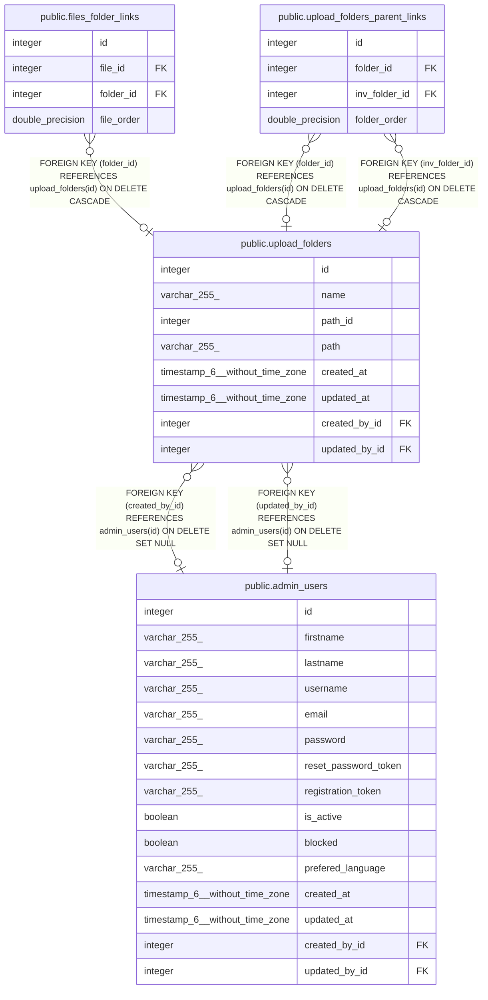

# public.upload_folders

## Description

## Columns

| Name | Type | Default | Nullable | Children | Parents | Comment |
| ---- | ---- | ------- | -------- | -------- | ------- | ------- |
| id | integer | nextval('upload_folders_id_seq'::regclass) | false | [public.files_folder_links](public.files_folder_links.md) [public.upload_folders_parent_links](public.upload_folders_parent_links.md) |  |  |
| name | varchar(255) |  | true |  |  |  |
| path_id | integer |  | true |  |  |  |
| path | varchar(255) |  | true |  |  |  |
| created_at | timestamp(6) without time zone |  | true |  |  |  |
| updated_at | timestamp(6) without time zone |  | true |  |  |  |
| created_by_id | integer |  | true |  | [public.admin_users](public.admin_users.md) |  |
| updated_by_id | integer |  | true |  | [public.admin_users](public.admin_users.md) |  |

## Constraints

| Name | Type | Definition |
| ---- | ---- | ---------- |
| upload_folders_created_by_id_fk | FOREIGN KEY | FOREIGN KEY (created_by_id) REFERENCES admin_users(id) ON DELETE SET NULL |
| upload_folders_updated_by_id_fk | FOREIGN KEY | FOREIGN KEY (updated_by_id) REFERENCES admin_users(id) ON DELETE SET NULL |
| upload_folders_pkey | PRIMARY KEY | PRIMARY KEY (id) |
| upload_folders_path_id_index | UNIQUE | UNIQUE (path_id) |
| upload_folders_path_index | UNIQUE | UNIQUE (path) |

## Indexes

| Name | Definition |
| ---- | ---------- |
| upload_folders_pkey | CREATE UNIQUE INDEX upload_folders_pkey ON public.upload_folders USING btree (id) |
| upload_folders_path_id_index | CREATE UNIQUE INDEX upload_folders_path_id_index ON public.upload_folders USING btree (path_id) |
| upload_folders_path_index | CREATE UNIQUE INDEX upload_folders_path_index ON public.upload_folders USING btree (path) |
| upload_folders_created_by_id_fk | CREATE INDEX upload_folders_created_by_id_fk ON public.upload_folders USING btree (created_by_id) |
| upload_folders_updated_by_id_fk | CREATE INDEX upload_folders_updated_by_id_fk ON public.upload_folders USING btree (updated_by_id) |

## Relations

---

> Generated by [tbls](https://github.com/k1LoW/tbls)
