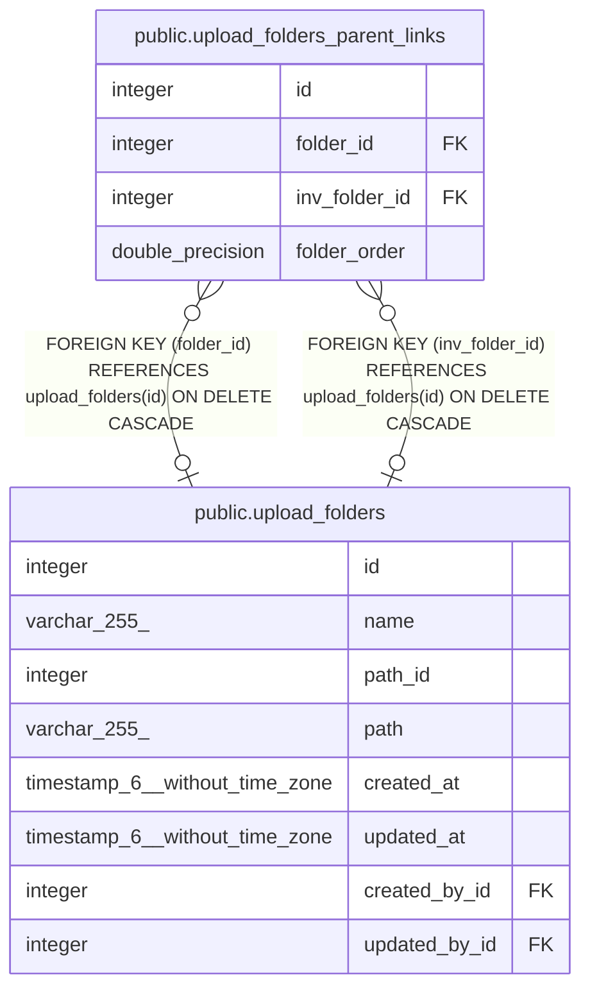

# public.upload_folders_parent_links

## Description

## Columns

| Name | Type | Default | Nullable | Children | Parents | Comment |
| ---- | ---- | ------- | -------- | -------- | ------- | ------- |
| id | integer | nextval('upload_folders_parent_links_id_seq'::regclass) | false |  |  |  |
| folder_id | integer |  | true |  | [public.upload_folders](public.upload_folders.md) |  |
| inv_folder_id | integer |  | true |  | [public.upload_folders](public.upload_folders.md) |  |
| folder_order | double precision |  | true |  |  |  |

## Constraints

| Name | Type | Definition |
| ---- | ---- | ---------- |
| upload_folders_parent_links_fk | FOREIGN KEY | FOREIGN KEY (folder_id) REFERENCES upload_folders(id) ON DELETE CASCADE |
| upload_folders_parent_links_inv_fk | FOREIGN KEY | FOREIGN KEY (inv_folder_id) REFERENCES upload_folders(id) ON DELETE CASCADE |
| upload_folders_parent_links_pkey | PRIMARY KEY | PRIMARY KEY (id) |
| upload_folders_parent_links_unique | UNIQUE | UNIQUE (folder_id, inv_folder_id) |

## Indexes

| Name | Definition |
| ---- | ---------- |
| upload_folders_parent_links_pkey | CREATE UNIQUE INDEX upload_folders_parent_links_pkey ON public.upload_folders_parent_links USING btree (id) |
| upload_folders_parent_links_fk | CREATE INDEX upload_folders_parent_links_fk ON public.upload_folders_parent_links USING btree (folder_id) |
| upload_folders_parent_links_inv_fk | CREATE INDEX upload_folders_parent_links_inv_fk ON public.upload_folders_parent_links USING btree (inv_folder_id) |
| upload_folders_parent_links_unique | CREATE UNIQUE INDEX upload_folders_parent_links_unique ON public.upload_folders_parent_links USING btree (folder_id, inv_folder_id) |
| upload_folders_parent_links_order_inv_fk | CREATE INDEX upload_folders_parent_links_order_inv_fk ON public.upload_folders_parent_links USING btree (folder_order) |

## Relations

---

> Generated by [tbls](https://github.com/k1LoW/tbls)
